Gondolatok a magyar kórházi ágyszám-, betegforgalmi- és halálozási
adatok elemzéséről, és néhány egészségpolitikai megjegyzés ezek ürügyén
================
Ferenci Tamás (<tamas.ferenci@medstat.hu>)

*„A gyávaság forrása, hogy az emberek nem tudják elképzelni a rossznál
még rosszabbat.”*

*(Örkény István)*

------------------------------------------------------------------------

Korábbi írásaim:

-   [Gondolatok a járványügyi adatok
    közléséről](https://github.com/tamas-ferenci/GondolatokAJarvanyugyiAdatokKozleserol)
-   [Gondolatok a favipiravir hatásosságáról, és a tudományos
    véleménynyilvánítás
    szabadságáról](https://github.com/tamas-ferenci/GondolatokAFavipiravirHatasossagarolEsATudomanyosVelemenynyilvanitasSzabadsagarol)
-   [Gondolatok a járvány elleni védekezés értékeléséről, és a járvány
    hatásának
    vizsgálatáról](https://github.com/tamas-ferenci/GondolatokAJarvanyElleniVedekezesErtekeleserolEsAJarvanyHatasanakVizsgalatarol)
-   [Gondolatok a védőoltásokkal kapcsolatos bizonytalanság
    megértéséről, és a saját portánk előtt
    söprögetésről](https://github.com/tamas-ferenci/GondolatokAVedooltasokkalKapcsolatosBizonytalansagMegerteserol)

------------------------------------------------------------------------

## A GYÓGYINFOK/OEP/NEAK kórházi ágyszám- és betegforgalmi kimutatása

A járványügyi adatok kapcsán korábban [már írtam
arról](https://github.com/tamas-ferenci/GondolatokAJarvanyugyiAdatokKozleserol),
hogy milyen a magyar adatközlési – vagy inkább adat nem közlési… –
rendszer, és hogy ez milyen iszonyatos károkat okoz véleményem szerint
az egész magyar népegészségügynek. Sajnos a transzparencia hiánya, az
adatok visszatartása közel nem csak a járványügyre igaz a magyar
egészségügyön belül; ennek egy másik példájáról fogok most írni.
Érinteni fogom a kórházak ágyszám- és betegforgalmi adatait, az
ágykihasználást, valamint a halálozást, ez utóbbi kapcsán hangsúlyosan
kitérek arra a sok helyen elmondott állításomra is, hogy a magyar
egészségügy egyik alapvető problémája a transzparens teljesítménymérés
szinte teljes hiánya.

A másik, most vizsgált aspektus ugyanis a kórházakra vonatkozó
adatközlés lesz.

A nagyon kevés, nyilvánosan elérhető, kórházak működésére és
teljesítményére vonatkozó magyar adatforrás egyike az ún. ágyszám- és
betegforgalmi kimutatás. Ezt évente közzéteszik, eleinte a
[GYÓGYINFOK](https://itf.njszt.hu/324rtr4/uploads/2020/10/a_szekszardi_gyogyinfok_rovid_tortenete.pdf)
készítette, majd 2004-től az Országos Egészségbiztosítási Pénztár (OEP),
mai nevén Nemzeti Egészségbiztosítási Alapkezelő (NEAK). Az adatok
2003-ig visszamenőleg [érhetőek
el](http://neak.gov.hu/felso_menu/szakmai_oldalak/publikus_forgalmi_adatok/gyogyito_megelozo_forgalmi_adat/fekvobeteg_szakellatas_stat/korhazi_agyszam.html)
nyilvánosan. (2003 előtti adatok létének könyvtárban [találtam
nyomát](https://nektar.oszk.hu/peldinfo_spring/peldinfo.htm?id=1013300&language=hu&view=1),
de elektronikusan nem sikerült fellelnem, pedig jó lenne még tágabbra
venni az elemzés időbeli átfogását.)

Ezek a kimutatások alapvetően három típusú adatot tartalmaznak: egyrészt
a kórházak ágyszámait (lebontva a szerint, hogy működő vagy szünetelő)
az év utolsó napján és egész éves átlagban, másrészt az elbocsátott
betegek számát, és lebontásukat meghalt, más osztályra áthelyezett,
otthonába távozott csoportok szerint (ez lehetővé teszi halálozási arány
számolását), harmadrészt az átlagos ápolási időtartamot (ezek együtt
lehetővé teszik ágykihasználás számolását). Ezeket az adatokat
megyénként, és szerencsére kórházanként is közlik, valamint alábontják
szakmai osztályonként is. Összességében tehát adott kórház adott
szakmájához lehet leásni. (A „szakma” itt nem azt jelenti, mint a
hétköznapi szóhasználatban, mondjuk, hogy orvos vagy ápoló, hanem azt,
amit szakterületnek szoktak hívni: urológia, szemészet, aneszteziológia
és intenzív betegellátás stb.) Fontos hiányossága még ennek az
adatközlésnek is, hogy a „szakmai osztály” nem ugyanaz, mint a kórházi
osztály: van kórház amelyik három különböző, adott esetben lényegesen
eltérő betegösszetételű és profilú intenzív osztályt is működtet, ám
ebben az adatközlésben ezek elkülönítése nem lehetséges. Az ilyen
különbségeket tehát még ez a relatíve finom felbontású adat is össze
fogja mosni, erre tekintettel kell lenni.

Bár azt írtam, hogy „nyilvánosan elérhető”, természetesen ebben is van
csavar: igen, nyilvánosan elérhető – csak épp egy nagyon nehezen
feldolgozható formában. (Persze már annak is örülni kell, hogy legalább
nem kinyomtatott, majd beszkennelt papíron [teszik
közzé](https://drive.google.com/file/d/1NUPx6DfgDlQmsImDFfrDM7RjQSBa2MHE/edit)…)
Jelesül, egy – több mint 300 oldalas! – PDF-fájlt valamint egy DOC-fájlt
tesznek közzé, amelyekben a számok szerencsére táblázatokban, de sajnos
össze-vissza szerepelnek: a táblázatokat megtörik különböző
kommentár-szövegek, több fejezetbe vannak szétosztva, véget érnek az
egyik oldalon, majd folytatódnak a következőn, stb.

Jelen projekt *elsődleges* célja ezeknek az adatoknak a beolvasása a
fenti nehézségek ellenére, majd összeállításuk és elérhetővé tételük egy
gépi úton is feldolgozható, további elemzéseket is kényelmesen lehetővé
tevő formában. *Másodlagos* célja a munkámnak néhány alapvető
adatvalidáció elvégzése, egy-két elemzés lefuttatása az immár
feldolgozható adatbázison, demonstrálva az így elérhetővé váló
lehetőségeket. Mindezek ürügyén fogok tenni pár kommentárt általában is
a magyar fekvőbeteg-ellátás szervezése (nagyképű szóval élve:
egészségpolitika) kapcsán.

## Technikai részletek

Fontosnak tartom az adatok feldolgozható formára való hozásának
technikai részleteit is közölni, részint mert talán önmagában is érdekes
lehet, emiatt igyekszem kommentálni is, illetve rámutatni a
nehézségekre, részint, hogy a munkám teljesen transzparens, bárki
számára reprodukálható legyen. Akit a technikai részletek nem
érdekelnek, de a számszerű eredményeket szeretné használni, itt
letöltheti feldolgozható, letisztított és egységes formában a magyar
aktív fekvőbeteg-ellátás 2003 és 2021 közötti ágyszám- és betegforgalmi
adatait: [CSV
formátum](https://github.com/tamas-ferenci/GondolatokAMagyarKorhaziAdatokElemzeserolEsNehanyEgeszsegpolitikaiMegjegyzes/raw/main/KorhaziAgyszamEsBetegforgalom.csv),
illetve [XLSX (Excel)
formátum](https://github.com/tamas-ferenci/GondolatokAMagyarKorhaziAdatokElemzeserolEsNehanyEgeszsegpolitikaiMegjegyzes/raw/main/KorhaziAgyszamEsBetegforgalom.xlsx).

A további elemzés – csakúgy mint a letöltés és adatfeldolgozás – [R
statisztikai
környezet](https://www.youtube.com/c/FerenciTam%C3%A1s/playlists?view=50&sort=dd&shelf_id=2)
alatt történt; az ehhez szükséges kódokat a fenti okokból az eredményt
közlő pontokban is megadom (akit ez nem érdekel, nyugodtan ugorja át a
szürke hátterű kódokat).

A további részletek [a függelékben](#technikai-részletek-1) olvashatóak.

## Adatvalidáció

Az adatok validitása alatt alatt nem azt értem, hogy melyik adat
„gyanús” vagy akár „szinte irreális” (fogunk ilyet is látni), hanem azt,
ami *matematikailag* lehetetlen, hogy jó legyen.

Két ilyen ellenőrzési lehetőséget találtam:

-   Az ágykihasználás visszaellenőrzése: több esetet találtam, amikor az
    elbocsátott betegek száma nagyobb, mint ami 100%-os
    ágykihasználásnál lehetne (figyelembe véve az átlagos ápolási
    időtartamot).
-   Elbocsátott betegek számának visszaellenőrzése: több esetet
    találtam, hogy ággyal nem rendelkező osztályok több beteget láttak
    el, mint ahány egynapos esetük volt.

Sajnos a fenti jelenségekre nem találtam magyarázatot.

Mivel ez most számunkra nem kulcsponti kérdés, a részleteket és az
eredményeket [a függelékben](adatvalidáció-1) közlöm.

## Betegforgalmi adatok

A kórházak működésének egyik legközvetlenebb mutatója a betegforgalom,
azaz a felvett majd elbocsátott betegek száma. (A kettő mindenképpen
egyezik egy adott szakmaosztály esetében, ugyanis a magyar terminológiai
„elbocsátottnak” nevezi a más osztályra áthelyezett és a meghalt
betegeket is.) Ez még persze nem olyan értelemben teljesítmény, ahogy a
köznyelv hívja („mennyire jó hatásfokú a gyógyítás”), de mégis ez az
első szintje a teljesítmény-vizsgálatnak. Egy további, második lépés
lehet az ilyen jellegű szempontok bevonása, erre később fogok rátérni.

Kezdjük először egy helyzetképpel: nézzük meg a magyar kórházak
szakmaosztályai által 2021-ben ellátott betegek számának eloszlását:

``` r
ggplot(res[Ev==2021], aes(x = ElbocsatottBetegSzam)) + geom_histogram(boundary = 0, bins = 30) +
  labs(x = "Elbocsátott betegek száma [fő]", y = "Gyakoriság [db]")
```

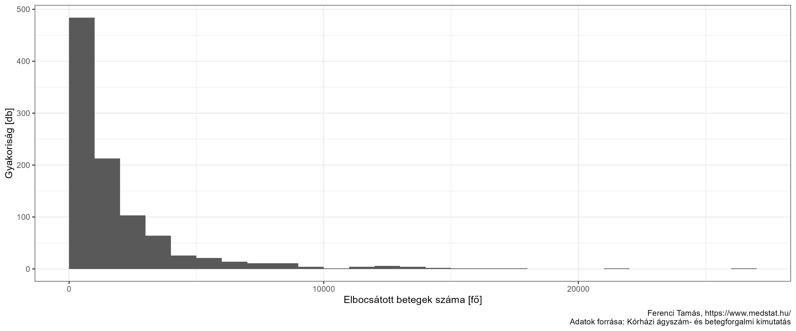<!-- -->

Ez önmagában még nem túl informatív, hiszen a különböző szakmák,
különböző kórházak nagyon eltérően viselkednek. Érdemes ezért az
eloszlást szakmánként ábrázolni:

``` r
ggplot(res[Ev==2021], aes(x = ElbocsatottBetegSzam, y = SzakmaMegnev)) +
  geom_jitter(width = 0, height = 0.1) + scale_y_discrete(limits=rev) +
  labs(x = "Elbocsátott betegszám [fő]", y = "")
```

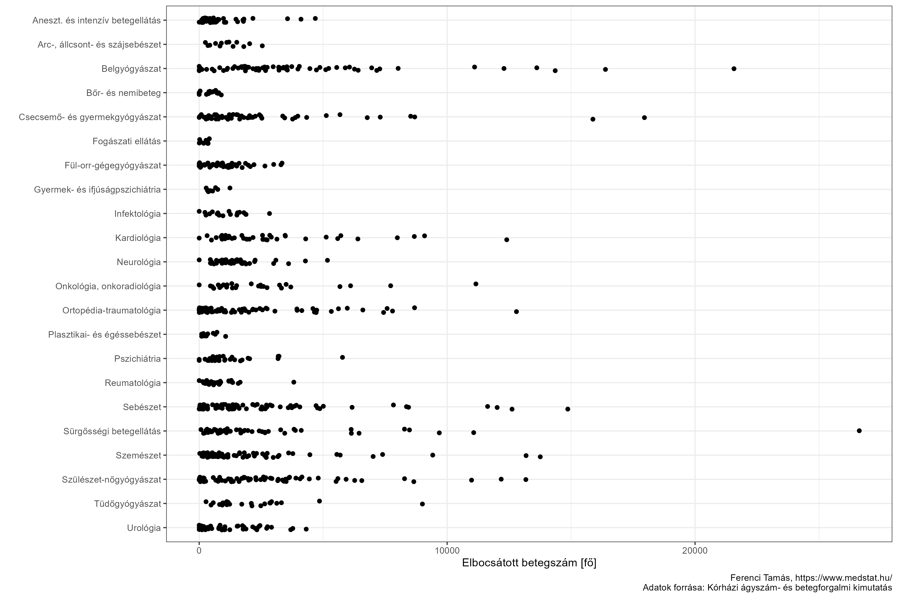<!-- -->

Nézzük meg a 2021-ben legkisebb és legnagyobb forgalmú osztályokat
szakmánként számszerűen is (ez persze elég kiragadott, hiszen egy-egy
osztály nem mond sokat a rendszer egészéről, de azért nagyon
illusztratív lesz):

``` r
kableExtra::add_header_above(
  kableExtra::kable(
    dcast(res[Ev==2021][NemSpecKh==TRUE&NemSpecSzakma==TRUE&MukodoAtlagAgy>0][
      , cbind(tipus = factor(c("Min", "Max"), levels = c("Min", "Max")),
              .SD[c(which.min(ElbocsatottBetegSzam), which.max(ElbocsatottBetegSzam))]), .(SzakmaMegnev)],
      SzakmaMegnev ~ tipus, value.var = c("ElbocsatottBetegSzam", "KorhazNev"))[, c(1, 2, 4, 3, 5)],
    col.names = c("Szakma", rep(c("Évi betegszám", "Kórház"), 2))),
  c(" " = 1, "Legkisebb" = 2, "Legnagyobb" = 2))
```

<table>
<thead>
<tr>
<th style="empty-cells: hide;border-bottom:hidden;" colspan="1">
</th>
<th style="border-bottom:hidden;padding-bottom:0; padding-left:3px;padding-right:3px;text-align: center; " colspan="2">

<div style="border-bottom: 1px solid #ddd; padding-bottom: 5px; ">

Legkisebb

</div>

</th>
<th style="border-bottom:hidden;padding-bottom:0; padding-left:3px;padding-right:3px;text-align: center; " colspan="2">

<div style="border-bottom: 1px solid #ddd; padding-bottom: 5px; ">

Legnagyobb

</div>

</th>
</tr>
<tr>
<th style="text-align:left;">
Szakma
</th>
<th style="text-align:right;">
Évi betegszám
</th>
<th style="text-align:left;">
Kórház
</th>
<th style="text-align:right;">
Évi betegszám
</th>
<th style="text-align:left;">
Kórház
</th>
</tr>
</thead>
<tbody>
<tr>
<td style="text-align:left;">
Aneszt. és intenzív betegellátás
</td>
<td style="text-align:right;">
5
</td>
<td style="text-align:left;">
Országos Orvosi Rehabilitációs Intézet
</td>
<td style="text-align:right;">
3936
</td>
<td style="text-align:left;">
Debreceni Egyetem Klinikai Központ
</td>
</tr>
<tr>
<td style="text-align:left;">
Arc-, állcsont- és szájsebészet
</td>
<td style="text-align:right;">
143
</td>
<td style="text-align:left;">
Somogy Megyei Kaposi Mór Oktató Kórház
</td>
<td style="text-align:right;">
1190
</td>
<td style="text-align:left;">
Szegedi Tudományegyetem Szent-Györgyi Albert Klinikai Központ
</td>
</tr>
<tr>
<td style="text-align:left;">
Belgyógyászat
</td>
<td style="text-align:right;">
3
</td>
<td style="text-align:left;">
Országos Reumatológiai és Fizioterápiás Intézet
</td>
<td style="text-align:right;">
19168
</td>
<td style="text-align:left;">
Debreceni Egyetem Klinikai Központ
</td>
</tr>
<tr>
<td style="text-align:left;">
Bőr- és nemibeteg
</td>
<td style="text-align:right;">
0
</td>
<td style="text-align:left;">
Bács-Kiskun Megyei Kórház, Kecskemét
</td>
<td style="text-align:right;">
497
</td>
<td style="text-align:left;">
Semmelweis Egyetem
</td>
</tr>
<tr>
<td style="text-align:left;">
Csecsemő- és gyermekgyógyászat
</td>
<td style="text-align:right;">
35
</td>
<td style="text-align:left;">
Karolina Kórház és Rendelőintézet, Mosonmagyaróvár
</td>
<td style="text-align:right;">
18287
</td>
<td style="text-align:left;">
Semmelweis Egyetem
</td>
</tr>
<tr>
<td style="text-align:left;">
Fül-orr-gégegyógyászat
</td>
<td style="text-align:right;">
41
</td>
<td style="text-align:left;">
Kiskunhalasi Semmelweis Kórház
</td>
<td style="text-align:right;">
1960
</td>
<td style="text-align:left;">
Borsod-Abaúj-Zemplén Megyei Központi Kórház és Egyetemi Oktatókórház
</td>
</tr>
<tr>
<td style="text-align:left;">
Gyermek- és ifjúságpszichiátria
</td>
<td style="text-align:right;">
313
</td>
<td style="text-align:left;">
Békés Megyei Központi Kórház
</td>
<td style="text-align:right;">
566
</td>
<td style="text-align:left;">
Heim Pál Országos Gyermekgyógyászati Intézet
</td>
</tr>
<tr>
<td style="text-align:left;">
Infektológia
</td>
<td style="text-align:right;">
865
</td>
<td style="text-align:left;">
Markusovszky Egyetemi Oktatókórház, Szombathely
</td>
<td style="text-align:right;">
7370
</td>
<td style="text-align:left;">
Borsod-Abaúj-Zemplén Megyei Központi Kórház és Egyetemi Oktatókórház
</td>
</tr>
<tr>
<td style="text-align:left;">
Kardiológia
</td>
<td style="text-align:right;">
0
</td>
<td style="text-align:left;">
Siófoki Kórház-Rendelőintézet
</td>
<td style="text-align:right;">
9790
</td>
<td style="text-align:left;">
Semmelweis Egyetem
</td>
</tr>
<tr>
<td style="text-align:left;">
Neurológia
</td>
<td style="text-align:right;">
87
</td>
<td style="text-align:left;">
Csongrád-Csanád Megyei Eü. Ellátó Közp. Hódmezővásárhely-Makó
</td>
<td style="text-align:right;">
2843
</td>
<td style="text-align:left;">
Semmelweis Egyetem
</td>
</tr>
<tr>
<td style="text-align:left;">
Onkológia, onkoradiológia
</td>
<td style="text-align:right;">
293
</td>
<td style="text-align:left;">
Szent Lázár Megyei Kórház, Salgótarján
</td>
<td style="text-align:right;">
6128
</td>
<td style="text-align:left;">
Semmelweis Egyetem
</td>
</tr>
<tr>
<td style="text-align:left;">
Ortopédia-traumatológia
</td>
<td style="text-align:right;">
145
</td>
<td style="text-align:left;">
Sátoraljaújhelyi Erzsébet Kórház
</td>
<td style="text-align:right;">
9519
</td>
<td style="text-align:left;">
Péterfy Kórház-Rendelőintézet és Manninger Jenő Országos Traumatológiai
Intézet
</td>
</tr>
<tr>
<td style="text-align:left;">
Plasztikai- és égéssebészet
</td>
<td style="text-align:right;">
20
</td>
<td style="text-align:left;">
Dél-pesti Centrumkórház - Országos Hematológiai és Infektológiai Intézet
</td>
<td style="text-align:right;">
875
</td>
<td style="text-align:left;">
Debreceni Egyetem Klinikai Központ
</td>
</tr>
<tr>
<td style="text-align:left;">
Pszichiátria
</td>
<td style="text-align:right;">
167
</td>
<td style="text-align:left;">
Borsod-Abaúj-Zemplén Megyei Központi Kórház és Egyetemi Oktatókórház
</td>
<td style="text-align:right;">
3696
</td>
<td style="text-align:left;">
Semmelweis Egyetem
</td>
</tr>
<tr>
<td style="text-align:left;">
Reumatológia
</td>
<td style="text-align:right;">
0
</td>
<td style="text-align:left;">
Petz Aladár Egyetemi Oktató Kórház
</td>
<td style="text-align:right;">
855
</td>
<td style="text-align:left;">
Betegápoló Irgalmas Rend
</td>
</tr>
<tr>
<td style="text-align:left;">
Sebészet
</td>
<td style="text-align:right;">
5
</td>
<td style="text-align:left;">
Országos Orvosi Rehabilitációs Intézet
</td>
<td style="text-align:right;">
10037
</td>
<td style="text-align:left;">
Semmelweis Egyetem
</td>
</tr>
<tr>
<td style="text-align:left;">
Szemészet
</td>
<td style="text-align:right;">
467
</td>
<td style="text-align:left;">
Szent Lázár Megyei Kórház, Salgótarján
</td>
<td style="text-align:right;">
10421
</td>
<td style="text-align:left;">
Semmelweis Egyetem
</td>
</tr>
<tr>
<td style="text-align:left;">
Szülészet-nőgyógyászat
</td>
<td style="text-align:right;">
608
</td>
<td style="text-align:left;">
Mezőtúri Kórház és Rendelőintézet
</td>
<td style="text-align:right;">
13302
</td>
<td style="text-align:left;">
Semmelweis Egyetem
</td>
</tr>
<tr>
<td style="text-align:left;">
Sürgősségi betegellátás
</td>
<td style="text-align:right;">
58
</td>
<td style="text-align:left;">
Toldy Ferenc Kórház és Rendelőintézet, Cegléd
</td>
<td style="text-align:right;">
16699
</td>
<td style="text-align:left;">
Semmelweis Egyetem
</td>
</tr>
<tr>
<td style="text-align:left;">
Tüdőgyógyászat
</td>
<td style="text-align:right;">
298
</td>
<td style="text-align:left;">
Tolna Megyei Balassa János Kórház
</td>
<td style="text-align:right;">
8611
</td>
<td style="text-align:left;">
Országos Korányi Pulmonológiai Intézet
</td>
</tr>
<tr>
<td style="text-align:left;">
Urológia
</td>
<td style="text-align:right;">
306
</td>
<td style="text-align:left;">
Dr. László Elek Kórház és Rendelőintézet, Orosháza
</td>
<td style="text-align:right;">
3013
</td>
<td style="text-align:left;">
Borsod-Abaúj-Zemplén Megyei Központi Kórház és Egyetemi Oktatókórház
</td>
</tr>
</tbody>
</table>

Mindezekből jól látszik a magyar egészségügyi ellátórendszer néhány
strukturális problémája. Vegyük például a szülészet-nőgyógyászat
szakmát! Itt egészen extrém esetek vannak: az ábra bal szélén lévő pont
a Mezőtúri Kórház, ami egész évben összesen 608 beteget látott el ebben
a szakmában. Ez természetesen nem mind szülés! A konkrét beavatkozások
kórházankénti számáról Magyarországon semmilyen információnk nem lehet,
az egyedüli kivétel azonban épp a szülések száma: egy [másik
kimutatásból](http://neak.gov.hu//data/cms1025544/Szules_csaszarmetsz_2015_2021_fin_ev.pdf)
ez az egy megnézhető, és így tudhatjuk, hogy ebben a kórházban 217
szülés volt 2021-ben. Azaz kevesebb, mint napi 1… (Nem akarom kipécézni
őket: 7 osztály van, ahol az 500-at sem érte el az éves szülések száma,
31, ahol az 1000-et sem.) Ilyen osztályokat minek fenntartani?! És itt
most nem az anyagi szempontokról beszélek: az itt dolgozó orvosok,
szakdolgozók nem fognak tudni manuális gyakorlatot szerezni, ezer más
dolgot kénytelenek csinálni, így nem tudnak elmélyedni ebben a konkrét
területben, nem fognak rendelkezésre állni a legkorszerűbb műszerek
(vagy ha igen, akkor meg elment egy halom pénz arra, hogy aztán szinte
teljesen kihasználatlanul álljanak). Nem lenne jobb – *a szülőnőknek
is*, sőt, elsősorban nekik! – ha olyan orvosok, szülésznők és ápolók
látnák el őket, akiknek bőséges manuális gyakorlatuk van, akik ezzel a
szűk területtel foglalkoznak, így sokkal inkább tudják követni a
szakirodalmat, és mindezt ott, ahol rendelkezésre állnak a legkorszerűbb
eszközök? Az egyetlen ellenérv a szemaskó-i stílusú „de legalább közel
van” megfontolás, csakhogy ebben a konkrét esetben ez is abszurd érv,
lévén, hogy a szülészet *pont hogy* egy jól tervezhető terület. (Ennél
még az infarktus-ellátás is ezerszer jobban centralizált – nagyon
helyesen! – pedig aligha lehet mondani, hogy ott kevésbé fontos, hogy
gyorsan ellátást kapjon a beteg, vagy, hogy jobban előre lehet tervezni
az eseményt…)

Azt, hogy a fent leírtak nem pusztán elméleti spekulációt jelentenek,
hanem a gyakorlatban is így vannak, ma már bőséges mennyiségű empirikus
bizonyíték is alátámasztja. A kérdést nagyon sokan, nagyon sokszor
megvizsgálták tényadatok alapján, egységes eredményekkel; kiragadott
példaként itt egy részlet egy ma már [klasszikus
kutatás](https://www.nejm.org/doi/10.1056/NEJMsa012337) eredményeiből:


Az ábrán az látszik, hogy négy különböző műtéttípus esetén (ez a négy
csoportja az oszlopoknak) hogyan alakul a – 30 napon belüli vagy kórházi
– halálozás a szerint, hogy az adott kórház mennyi műtét végez a
kérdéses típusból (minél világosabb az oszlop, annál többet). Az
eredmény nem igényel sok kommentárt: a növekvő gyakorlattal csökken,
esetenként egészen drámai mértékben a halálozás. (Természetesen
felvethető, hogy a különböző kórházak más összetételű, például más
súlyosságú vagy életkorú betegeket láttak el – ez a probléma egyébként
később nálunk is jelentkezni fog egy kérdés kapcsán – de az eredmények
erre már korrigálva vannak.)

Szó szerint több ezer hasonló vizsgálat
[készült](https://pubmed.ncbi.nlm.nih.gov/?term=volume+outcome) az idők
folyamán, különböző országokban, különböző időintervallumokban, a
legkülönfélébb beavatkozásokra, lényében a fentivel egyező
eredményekkel. Tulajdonképpen minden beavatkozásra, műtétre
megvizsgálható ez a kérdés, olyannyira, hogy nemzetközileg több helyen
már [az is
megtörtént](https://www.sciencedirect.com/science/article/abs/pii/S016885101830424X),
hogy a betegbiztonság érdekében minimális szükséges esetszámot
[határoztak meg](https://www.karger.com/Article/Fulltext/456041)
kórházra, vagy akár orvosra is, beavatkozás-típusonként. [Így néz
ki](https://www.g-ba.de/downloads/62-492-2882/Mm-R_2022-06-16_iK-2022-07-16-2022-01-01.pdf)
például a német szabályozás, mondjuk a 16. oldalra lépve azt látjuk,
hogy totál térdprotézis-műtétből 50 eset/kórház/év a betegbiztonsági
minimum. Természetesen ennek a megvalósulása is transzparansen
[lekérdezhető](https://www.bindoc.de/statistik-tool): a
»Mindestmengenregelung« pontra kattintva láthatjuk az összes német
kórházat, hogy adott, szabályozás alá eső beavatkozásból – ez a
»Leistungsart« pontban állítható – mennyit végeztek; szín jelöli a
megfelelést. Folytatva a példát, a Klinikum Barnim 68 térdprotézis-műtét
végzett így zölden világít, de az Asklepios Klinikum Uckermark csak
32-t, ezért a piros szín. Költői kérdés: vajon mikor fogunk ide eljutni
Magyarországon…? Jelenleg a szülés az *egyetlen* esemény, aminek
legalább az esetszámát le lehet kérdezni kórházanként, ezen kívül
*semmilyen* beavatkozás számáról nem érhető el semmilyen információ
transzparensen.

De mi a helyzet a szülésekkel, ha már egyszer ezt hoztam fent problémás
hazai példaként? Szerencsére erre vonatkozóan is vannak eredmények.
[Heller és mtsai](https://academic.oup.com/ije/article/31/5/1061/745823)
azt találták német adatokat vizsgálva, hogy azokon a szülészeteken, ahol
évi 500-nál kevesebb szülést vezetnek, 3,5-szer (!) akkora az
újszülött-halandóság mint ahol több mint 1500 szülés van. (Emlékeztetek
rá, hogy van olyan magyar kórház, ahol szülészet-nőgyógyászati
ellátásból *összesen* alig van 500, nemhogy szülésből.) Több vizsgálat
megerősítette, hogy az anyai komplikációknál is hasonló a helyzet. Ilyen
szempontból kifejezetten érdekes [Kozhimannil és
mtsai](https://www.thieme-connect.com/products/ejournals/abstract/10.1055/s-0035-1570380)
amerikai kutatása, amelyben külön is nézték az intézményeket típus
szerint. A mi kérdéskörünkhoz legközelebb álló „városi, de nem oktató”
kategóriában (alsó harmad: kevesebb mint 650 szülés, középső harmad:
650-1400 szülés, felső harmad: több mint 1400 szülés évente) azt
találták, most csak a statisztikailag szignifikáns eredményeket idézem,
hogy a közepes intézményekben 19%-kal, a kis intézményekben 39%-kal
nagyobb a postpartum vérzés esélye, mint a nagy intézményekben, a
vérátömlesztés-igény a közepesekben 18%-kal nagyobb esélyű, a kicsikben
24%-kal, továbbá a közepes intézményekben a súlyos gátsérülés esélye is
8%-kal nagyobb mint a nagy intézményekben (és mindössze egy ellentétes
adat van, a magzatburok-gyulladás ritkább a közepesekben). A sort
lehetne folytatni, vannak ellentétes eredmények, ha jóval kisebb számban
is, de a meta-analízisek a fenti konklúziót erősítik meg, a nagy
kockázatú szülések esetén egyértelműen
([Obladen](https://www.thieme-connect.com/products/ejournals/abstract/10.1055/s-2007-960745)),
de a kis kockázatúak esetében is efelé mutatnak az eredmények ([Walther
és
mtsai](https://bmcpregnancychildbirth.biomedcentral.com/articles/10.1186/s12884-021-03988-y)).

Nem tudok ilyen jellegű magyar kutatásról mint az előbbiek – miközben ez
alapvető fontosságú lenne a hazai szülészeti ellátás minőségének a
javításához. Ebben az az igazán szomorú, hogy minden adat és módszertani
tudás rendelkezésre állna ehhez Magyarországon is, egyedül szándék
kérdése lenne, hogy ezt empirikus alapon, itthon is megvizsgáljuk és az
eredményeket transzparensen közöljük. Tegyük hozzá, hogy egyedülállóan
büszkék lehetnénk arra, hogy – Tauffer Vilmosnak köszönhetően – a
világviszonylatban is párját ritkító adatgyűjtést
[folytatunk](http://medicalonline.hu/cikk/a_szuleszeti__adatszolgaltatas_helyzete_hazankban),
1931 óta. Ehhez képest ott tartunk, hogy hétköznapi halandó számára
feldolgozható formában lényegében semmilyen információ nem érhető el
ebből, a Tauffer-statisztika honlapján a legfrissebb összefoglaló
jelentés 2009-es (!) és egyébként [így néz
ki](http://193.225.50.35/dokumentum/S2009/tauffer_stat.ppt). Mindezt
2022-ben.

Nagyobb újszülött-halandóság, gyakoribb postpartum vérzés, gyakoribb
súlyos gátsérülés – csak annyit kérdeznék: megérte, hogy közel van?

Arról nem beszélve, hogy bár 31 kórházban nincs évi 1000 szülés,
mindössze egyetlen megye van, ahol a megyében sincs legalább 1000
szülést levezető kórház (és ez is csak éppenhogy: Tolnában 982 szülést
vezetett a Balassa János Kórház). Magyarul: szinte minden esetben
ugyanazon megyén belül is volna olyan kórház, ahol kellő gyakorlattal
rendelkeznek. Orosházán úgy vezetnek évi kevesebb mint 500 szülést, hogy
onnan 39 kilométerre található a Békés Megyei Központi Kórház évi
majdnem 2000 szüléssel. Pécsen az ország egyik legnagyobb, egyetemi
klinika szintű szülészetétől 36 és 45 kilométerre is vezetnek szülést,
közülük a nagyobbikban van évi 681 szülés. (Nekünk Mohács kell! –
bocsánat.) A legextrémebb példa talán Jász-Nagykun-Szolnok megye, ahol
*négy* helyen is vezetnek szülést, de úgy, hogy ebből háromban kevesebb
mint 700 az évi esetszám.

A valódi magyarázat tehát azt hiszem teljesen más: annak politikai
következményei jelentik a problémát, hogy egy osztályt – pláne kórházat
– bezár a kormány. Sajnos az elmúlt 20 év bőven szolgáltatott példát
arra, hogy kis számú kivételtől eltekintve fundamentálisan senki nem
jobb a deákné vásznánál, úgyhogy hadd fogalmazzak úgy: a *mindenkori*
ellenzék azonnal rávetné magát, jó eséllyel a legolcsóbb és
leghitványabb demagógiát használva, hogy „a kormány kórházat zár be!!!”
(pláne egy szülészetet, atyaisten!). Senkit nem érdekel, hogy ez
egyébként egy jó döntés – mint ahogy szakmai téren nincs is semmiféle
vita, hogy az ilyen osztályok fenntartása értelmetlen, illetve az még
hagyján, de hátrányos a betegeknek –, csak az számít, hogy a lakosság
körében ez elfogadhatatlan, innentől pedig tökéletes alapanyag az
egyébként jó intézkedéssel szembeni uszításhoz. Azaz: csak az számít,
hogy rövidtávon lehet a politikai pecsenyét sütögetni ezen.

Persze nem csak a mindenkori ellenzékről van szó, a saját párttal is meg
kell küzdeni, hiszen jönni fog a helyi polgármester, jönni fog a körzet
országgyűlési képviselője, hogy ne csináljuk már, így hogy fogják őt
legközelebb megválasztani?! (Ami persze a pártunknak is érdeke!) Sőt, ha
már teljeskörűek vagyunk, akkor van még egy nagyon fontos szereplő: a
kórházigazgató, az osztályvezető, akik – jó esetben presztízs-, rang-,
rosszabb esetben anyagi érdekből kifolyólag – szintén nagyon is
érdekeltek személyesen az osztály, a kórház fennmaradásban, ráadásul
szavukkal nagy hatást tudnak elérni, pláne kisebb településeken.

Félreértés ne essék, ez egy nagyon érzékeny, sok helyen összekötött
rendszer, aminek nem lehet egy kiragadott eset alapján hentesbárddal
nekiesni; a konkrét példánál maradva: a kis szülészetek bezárása a
mentőszolgálat megerősítésével együtt képzelhető el.

(Valójában ez sem ilyen egyszerű. Az a gond, hogy van még egy szempont:
a korábbiban említett nagy hatalmú szereplők igen komoly kapacitással és
rutinnal rendelkeznek abban, hogy „rendben, csak dolgozzunk ki előbb
minden részletet” jelszó alatt valójában elszabotálják az egészet,
úgyhogy néha igenis jobb – a betegeknek is! – az egy lépcsőben történő
bevezetés majd később finomítás stratégiája. Sokszor muszáj elkezdeni,
ha nagyjából megvan a terv, aztán a hibákat menet közben javítani, mert
ha már eleve is tökéletesre akarunk mindent megtervezni, akkor az
egyrészt lehetetlen, másrészt ha megpróbáljuk, akkor még 10 év múlva is
csak tervezni fogunk. Hogy így viszont zavarok lesznek egy ideig? Igen.
Hogy ebbe emberek fognak belehalni? Igen. Csak míg a jelenlegi állapotba
*minden nap* emberek halnak bele, *csak értük senki nem emel szót*,
addig az átalakításba csak addig, amíg nem érünk a végére, és utána már
*kevesebben* fognak meghalni.)

És még egyetlen gondolat ehhez. Emlékszik az olvasó, hogy melyik volt a
legkisebb forgalmú szülészet? A Mezőtúri Kórház. Ha az ember felmegy a
Nemzeti Népegészségügyi Központ (NNK) honlapjára, akkor megtalálja [azt
a
részt](https://www.nnk.gov.hu/index.php/egeszsegugyi-igazgatasi-foosztaly/nyilvantartasok/ellatasi-teruletek-nyilvantartasai/kijeloles),
ami az úgynevezett kijelölő határozatokat tartalmazza: az NNK akkor ad
ki ilyet, ha egy kórház valamilyen okból akadályozott egy
tevékenységének elvégzésében (és ekkor kijelöl helyette másikat). És ha
megnézzük ezt jobban, akkor mit látunk? Azt, hogy a Mezőtúri Kórház
előbb 2022. június 10., 11., 12. és 14. napokra [mondta
le](https://www.nnk.gov.hu/attachments/article/446/6517-4-2022_Mez%C5%91t%C3%BAri%20K%C3%B3rh%C3%A1z%20Rendel%C5%91%20-%20Kijel%C3%B6l%C3%A9s.pdf)
a szülészeti ügyeletet (a kórház indoklása: „aneszteziológus szakorvos
hiánya”), aztán lemondta 21., 23., 28., 29. és 31. [napokra
is](https://www.nnk.gov.hu/attachments/article/446/6517-6-2022_Mez%C5%91t%C3%BAri%20K%C3%B3rh%C3%A1z%20-%20Kijel%C3%B6l%C3%A9s.pdf),
(indoklás: „aneszteziológus szakorvos hiánya”), majd végül július 1-3.,
5., 8-10., 12-17., 19-21., 26. és 28. [napokra
is](https://www.nnk.gov.hu/attachments/article/446/6517-6-2022_Mez%C5%91t%C3%BAri%20K%C3%B3rh%C3%A1z%20%C3%A9s%20Rendel%C5%91int%C3%A9zet%20-%20Kijel%C3%B6l%C3%A9s.pdf)
lemondta (indoklás: „aneszteziológus szakorvos hiánya”). De szerencsére
van szülészet Mezőtúron, ez a lényeg!

Külön bája (?) a történetnek, hogy mindeközben a szolnoki Hetényi Géza
Kórháznak, amit az NNK kijelölt a mezőtúri helyett, összesen *öt*
különböző akadályoztatás miatti kijelölő határozata van ezen a
területen, ugyanis a Hetényi május 21-22., június 3-5., 8., 11., 13.,
17-18., 22-23., 27., 29-30., július 1-4., 9-10., 15-16., 19., 23., 31.
napjaira lemondta a szülőszobai ügyeletet és a hozzá kapcsolódó
újszülött ellátást (az indoklás minden esetben: „személyi feltételek
átmeneti hiánya”, magyarán minden bizonnyal szülész-nőgyógyászuk
nincsen), valamint július 1-től meghatározatlan ideig lemondta a
csecsemő intenzív ellátást is (indoklás: „szakdolgozó hiány”).

Így előáll az az egészen hihetetlen helyzet, hogy van két kórház,
egymástól 50 km-re, amelyek egyike sem tud teljes szülészetet adni, mert
az egyikben van szülész-nőgyógyász, de nincs aneszteziológus, a másikban
van aneszteziológus, de nincs szülész-nőgyógyász, de a politikának *még
ez is jobb*, minthogy legyen egyetlen kórház, ami viszont cserében
esetleg mondjuk működik is. Mert, ugye, ahhoz valamit be kellene zárni.

Ne legyenek illúziónk arról, hogy ebbe a helyzetbe nem halhatnak-e bele
emberek. (Csak arra reflektálva, hogy egy átalakítás egy ideig káosszal
jár.) Az NNK honlapján e pillanatban 225 kijelölő határozat van
2022-ből.

(Hogy akkor most összeomlott a magyar egészségügy? Népszerű toposz az
egészségügy összeomlása, általában az aktuális ellenzék prognosztizálja
ezt jövőre. Én emlékszem arra is, hogy 2006-ban fog jövőre összeomlani
az egészségügy, most is jövőre fog összeomlani az egészségügy. Nem, az
egészségügy – nagyon extrém esetektől eltekintve – nem tud összeomlani.
*Valahogy* fog működni, bármi történik, „maximum” emberek rosszabb, vagy
sokkal rosszabb ellátást kapnak, mint lehetne.)

## Ágyszámra vonatkozó adatok

Bármely egészségügyi rendszer fekvőbeteg-ellátó ágának egyik
legalapvetőbb és a közvélemény előtt elsődleges fontosságúként
megjelenő, egyetlen számba sűrített jellemzője a kórházi ágyak száma.

Azért is emeltem ki külön a közvélemény szerepét, mert remélem már a
korábbi fejtegetések is rámutattak arra, hogy valójában ez egy nagyon
káros szemlélet. Itt nincs mód ennek a teljes megtárgyalására, de néhány
szempontot felvetnék.

Egyik az a – klasszikus szocialista – szemlélet, hogy a százezer lakosra
jutó kórházi ágyak száma olyan, mint a százezer lakosra jutó
cementgyártás vagy a százezer lakosra jutó gabonatermelés: minél
nagyobb, annál jobban teljesít az ország. Valójában az egészségügy
teljesítménye szempontjából a kórházi ágyak számának nem feltétlenül van
több jelentősége, mint a kórházi ablakok számának, de erről majd picit
később. Mindez ráadásul a lakosság szemléletébe is *nagyon* mélyen
beivódott, talán ez az egyik oka annak, amiért a „kórházbezárás” már
mint szó is hihetetlenül erős negatív érzelmeket vált ki a legtöbb
emberből (és ezt – sajnos – a politikusok is jól tudják, de erről
szintén kicsit később).

A másik ok a magyar egészségügy történeti szerveződése: a klasszikus
szovjet szervezési modell (a szemaskói szisztéma) egyik jellemzője a
teljesen vegyes minőségű, földrajzilag fragmentált ellátás, magyarra
fordítva: „olyan amilyen, de közel van”. És itt is hatalmas probléma,
hogy az évtizedek alatt ez egyszerűen beleivódott az emberek
gondolkodásába, hovatovább ők maguk várják ezt el.

A másik gond ezzel a technikai fejlődés kérdése: egy sor beavatkozás
van, ami miatt 50 évvel ezelőtt még indokolt is volt valakit kórházba
fektetni, de ma már nem az. Nő az ambulánsan (egynapos ellátásban)
megoldható esetek aránya, akár nagyon rövid idő alatt is: 2007-ben még a
szürkehályog-műtétek mindössze 11,7%-át [végezték
így](https://www.oecd-ilibrary.org/sites/4dd50c09-en/1/3/9/7/index.html?itemId=/content/publication/4dd50c09-en&_csp_=82587932df7c06a6a3f9dab95304095d&itemIGO=oecd&itemContentType=book)
Magyarországon, 2017-ben már 58,1%-át. Lehetőségek egész sora vált
elérhetővé, amivel meg lehet spórolni a kórházi ellátást; ezzel persze
ezek a kapacitások feleslegessé válnak.

Valójában a kórházcentrikusság és a nagy ágyszám nem egyszerűen
„indokolatlan” vagy „felesleges”, hanem aktívan káros: a kórház a lehető
legrosszabb megoldás, mindenkinek. A legrosszabb az államnak is, mert a
fölényesen legdrágább ellátási forma (ez természetesen nem egyszerűen
„csak pénzt” jelent, hiszen az itt elköltött pénzt az egészségügy más
területéről kell elvonni), de nem jó a betegnek sem, mert
fertőzésveszélyes, mert hosszabb ideig tart a lábadozás, mert megterhelő
egy vadidegen környezetben gyógyulni. Tehát amit lehet, azt nem
kórházban kellene megoldani, például amit csak lehet, meg kell tenni az
egynapos ellátások fejlesztéséért.

A probléma az, hogy bár mondhatjuk, hogy „ezek a kapacitások
feleslegessé”, vagy, mint láttuk, jobban mondva egyenesen károssá
válnak, leépíteni meg nem könnyű, épp a korábban vázolt politikai okok
és egyéni érdekek miatt (és sok esetben a finanszírozás is ezt
preferálja). A dolog ráadásul visszafelé is hat: a túlzottan
kórházcentrikus struktúra aktívan nehezíti az említett korszerű
technikák terjedését, hiszen lesznek szereplők, akik ellenérdekeltek a
kórházak kiváltásában, hiába lenne ez mind a betegnek, mind az államnak
jobb. A végeredmény? Részletes kommentár helyett csak vessünk egy
pillantást (most ismét az Eurostat adatok alapján, hiszen
összehasonlítás fog jönni) az átlagos kórházban töltött időtartamra az
egyes európai országokban; piros jelöli Magyarországot:

``` r
res2 <- as.data.table(eurostat::get_eurostat("hlth_co_inpst"))
res2 <- res2[age=="TOTAL"&sex=="T"&icd10=="A-T_Z"]
ggplot(res2, aes(x = time, y = values, group = forcats::fct_reorder(geo, geo=="HU", .fun = first),
                 color = geo=="HU")) + geom_line() +
  scale_color_manual(values = c("FALSE" = "gray", "TRUE" = "red")) + guides(color = "none") +
  labs(x = "Év", y = "Átlagos kórházi tartózkodás [nap]")
```

<!-- -->

Nem csak arról van szó, hogy a magyar adat nagyon magas, hanem arról is,
hogy – egészen párját ritkítóan *még nő is* az évek alatt.

Itt csak egyetlen bekezdés erejéig tudok kitérni rá, de természetesen a
kórházakat, a fekvőbeteg-ellátást nem lehet izoláltan nézni, az egész
rendszer számít. Közhelyet tudok csak mondani: míg az elmélet az, hogy a
hármas tagozódásban (alapellátás – járóbeteg-szakellátás –
fekvőbeteg-szakellátás, pongyolán, de hétköznapi kifejezésekkel élve:
háziorvos – szakrendelő – kórház) minden lejjebb lévő szint szűrő
szerepet valósít meg, és a beteg csak akkor kerül feljebb, ha alsóbb
szinten nem oldható meg a problémája, a valóságban ez minimálisan
valósul meg. Ennek csak az lehet az eredménye, hogy olyanok is fekszenek
kórházban, akiknek nem kellene. Jól ismert, hogy a „kapuőri” háziorvosok
valójában annyira túlterheltek, hogy esélyük sincs ezt érdemben
megoldani, ráadásul itt nem csak az orvosokról van szó, sokszor maguk a
betegek is azt érzik kívánatosnak, hogy továbbmenjenek az
ellátórendszerben és a háziorvos szerepe csak annyi, hogy adjon
beutalót. Nem véletlenül mondják állandóan, hogy milyen fontos lenne az
alapellátás erősítése. (Azt kell közelvinni a beteghez, nem a kórházat!)

Mielőtt rátérünk a magyar adatok részletes elemzésére, egy pillanat
erejéig egyetlen összesítő számot nézzünk meg európai egybevetésben:
mennyi a százezer lakosra jutó aktív kórházi ágyak száma. A legfrissebb
adat 2019-es:

``` r
res2 <- as.data.table(eurostat::get_eurostat("hlth_rs_bds"))
res2 <- res2[unit=="P_HTHAB"&facility=="HBEDT_CUR"&time=="2019-01-01"&nchar(geo)==2]
res2$countryname <- countrycode::countrycode(res2$geo, "eurostat", "cldr.name.hu")
ggplot(res2[order(values, decreasing = TRUE)],
       aes(y = factor(countryname, levels = countryname), x = values, fill = geo=="HU")) +
  geom_col() + guides(fill = "none") + labs(x = "Aktív kórházi ágyak száma [ágy/100 ezer fő]", y = "")
```

<!-- -->

A dolog sok kommentárt nem igényel (érdemes azt is megnézni, hogy
mennyire szépen megjelenik a szocialista örökség máshol is, illetve,
hogy mennyire fals az a kép, hogy a magas ágyszám automatikusan azt
jelenti, hogy jobb a helyzet – amit elvileg jelent az az hozzáállás, ami
szerint az ágyszám-csökkentés automatikusan rossz). *Még most is* a
lista tetején vagyunk.

Egyébként pont a járvány elején merült fel gondolatként, hogy bár a
magyar egészségügyi rendszer kórházcentrikussága általában rossz hír, de
most, egy ilyen helyzetben kivételesen pont jól jön. Ahogy telt az idő,
kiderült, hogy valójában még ez sem igazán valósul meg: az elsődleges
szűk keresztmetszet ugyanis ilyen helyzetben sem az ágy, vagy épp az
orvostechnikai berendezés, legyen az lélegeztetőgép vagy bármi más, nem
a műszer volt Magyarországon, hanem egész egyszerűen a szakember. Az
orvos, de még inkább: az ápoló.

Vegyük példának Dániát: miközben ott kórházi ágyból 40%-kal kevesebb van
lakosságarányosan mint nálunk, ahogy a fenti ábra is mutatja, addig
orvosból mégis [ott van
több](https://ec.europa.eu/eurostat/databrowser/view/HLTH_RS_PRS1/default/table?lang=en&category=hlth.hlth_care.hlth_res.hlth_staff),
ha csak a kórházban dolgozó orvosokat nézzük, [akkor
pláne](https://ec.europa.eu/eurostat/databrowser/view/HLTH_RS_PRSHP1/default/table?lang=en&category=hlth.hlth_care.hlth_res.hlth_staff).
Az igazi dráma azonban nem is itt van, [hanem a
szakdolgozóknál](https://ec.europa.eu/eurostat/databrowser/view/HLTH_RS_PRSHP1/default/table?lang=en&category=hlth.hlth_care.hlth_res.hlth_staff):
ápolóból lakosságarányosan több mint kétszer (!) annyi van Dániában,
mint Magyarországon!

Visszatérve a magyar adatokhoz, ássunk most kicsit mélyebbre! Kezdjük a
2021-es évvel. Elsőként nézzük meg az ágyszámok eloszlását (itt és a
továbbiakban csak azokkal az intézményekkel foglalkozunk, ahol van
egyáltalán működő ágy), az átlagos működő ágyszámot alapul véve:

``` r
ggplot(res[Ev==2021][MukodoAtlagAgy>0], aes(x = MukodoAtlagAgy)) + geom_histogram(boundary = 0, bins = 30) +
  labs(x = "Működő átlagos ágyszám", y = "Gyakoriság [db]")
```

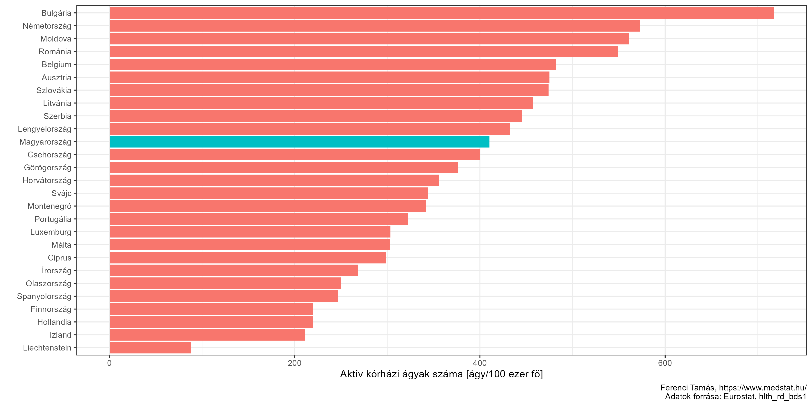<!-- -->

Adná magát a gondolat, hogy foglalkozzunk a legkisebb vagy épp
legnagyobb osztályokkal, de ez nagyon félrevezető lenne, mert az egyes
szakmák lényegesen eltérő jellegűek lehetnek. Ez önmagában is érdekes,
úgyhogy készítsünk róla egy ábrát:

``` r
ggplot(res[Ev==2021][MukodoAtlagAgy>0], aes(x = MukodoAtlagAgy, y = SzakmaMegnev)) + 
  geom_jitter(width = 0, height = 0.1) + scale_y_discrete(limits=rev) +
  labs(x = "Működő átlagos ágyszám", y = "")
```

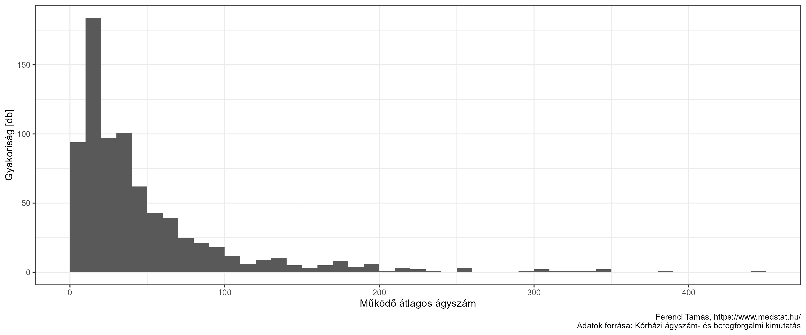<!-- -->

Itt már látszanak a különbségek! Az önmagában vett érdekességen túl itt
is nézzük meg szakmánként is a legkisebb és legnagyobb (ágyszámú)
osztályokat:

``` r
kableExtra::add_header_above(
  kableExtra::kable(
    dcast(res[Ev==2021][NemSpecKh==TRUE&NemSpecSzakma==TRUE&MukodoAtlagAgy>0][
      , cbind(tipus = factor(c("Min", "Max"), levels = c("Min", "Max")),
              .SD[c(which.min(MukodoAtlagAgy), which.max(MukodoAtlagAgy))]), .(SzakmaMegnev)],
      SzakmaMegnev ~ tipus, value.var = c("MukodoAtlagAgy", "KorhazNev"))[, c(1, 2, 4, 3, 5)],
    col.names = c("Szakma", rep(c("Ágyszám", "Kórház"), 2))),
  c(" " = 1, "Legkisebb" = 2, "Legnagyobb" = 2))
```

<table>
<thead>
<tr>
<th style="empty-cells: hide;border-bottom:hidden;" colspan="1">
</th>
<th style="border-bottom:hidden;padding-bottom:0; padding-left:3px;padding-right:3px;text-align: center; " colspan="2">

<div style="border-bottom: 1px solid #ddd; padding-bottom: 5px; ">

Legkisebb

</div>

</th>
<th style="border-bottom:hidden;padding-bottom:0; padding-left:3px;padding-right:3px;text-align: center; " colspan="2">

<div style="border-bottom: 1px solid #ddd; padding-bottom: 5px; ">

Legnagyobb

</div>

</th>
</tr>
<tr>
<th style="text-align:left;">
Szakma
</th>
<th style="text-align:right;">
Ágyszám
</th>
<th style="text-align:left;">
Kórház
</th>
<th style="text-align:right;">
Ágyszám
</th>
<th style="text-align:left;">
Kórház
</th>
</tr>
</thead>
<tbody>
<tr>
<td style="text-align:left;">
Aneszt. és intenzív betegellátás
</td>
<td style="text-align:right;">
1.2
</td>
<td style="text-align:left;">
Országos Reumatológiai és Fizioterápiás Intézet
</td>
<td style="text-align:right;">
105.0
</td>
<td style="text-align:left;">
Szegedi Tudományegyetem Szent-Györgyi Albert Klinikai Központ
</td>
</tr>
<tr>
<td style="text-align:left;">
Arc-, állcsont- és szájsebészet
</td>
<td style="text-align:right;">
7.0
</td>
<td style="text-align:left;">
Somogy Megyei Kaposi Mór Oktató Kórház
</td>
<td style="text-align:right;">
26.0
</td>
<td style="text-align:left;">
Semmelweis Egyetem
</td>
</tr>
<tr>
<td style="text-align:left;">
Belgyógyászat
</td>
<td style="text-align:right;">
3.7
</td>
<td style="text-align:left;">
Deák Jenő Kórház, Tapolca
</td>
<td style="text-align:right;">
389.0
</td>
<td style="text-align:left;">
Szabolcs-Szatmár-Bereg Megyei Kórházak és Egyetemi Oktatókórház
</td>
</tr>
<tr>
<td style="text-align:left;">
Bőr- és nemibeteg
</td>
<td style="text-align:right;">
0.4
</td>
<td style="text-align:left;">
Pest Megyei Flór Ferenc Kórház, Kistarcsa
</td>
<td style="text-align:right;">
30.0
</td>
<td style="text-align:left;">
Borsod-Abaúj-Zemplén Megyei Központi Kórház és Egyetemi Oktatókórház
</td>
</tr>
<tr>
<td style="text-align:left;">
Csecsemő- és gyermekgyógyászat
</td>
<td style="text-align:right;">
4.0
</td>
<td style="text-align:left;">
Szent Imre Egyetemi Oktatókórház
</td>
<td style="text-align:right;">
384.7
</td>
<td style="text-align:left;">
Heim Pál Országos Gyermekgyógyászati Intézet
</td>
</tr>
<tr>
<td style="text-align:left;">
Fül-orr-gégegyógyászat
</td>
<td style="text-align:right;">
7.1
</td>
<td style="text-align:left;">
Szent Damján Görögkatolikus Kórház
</td>
<td style="text-align:right;">
54.0
</td>
<td style="text-align:left;">
Debreceni Egyetem Klinikai Központ
</td>
</tr>
<tr>
<td style="text-align:left;">
Gyermek- és ifjúságpszichiátria
</td>
<td style="text-align:right;">
15.0
</td>
<td style="text-align:left;">
Heim Pál Országos Gyermekgyógyászati Intézet
</td>
<td style="text-align:right;">
24.0
</td>
<td style="text-align:left;">
Szegedi Tudományegyetem Szent-Györgyi Albert Klinikai Központ
</td>
</tr>
<tr>
<td style="text-align:left;">
Infektológia
</td>
<td style="text-align:right;">
20.0
</td>
<td style="text-align:left;">
Dr. Bugyi István Kórház, Szentes
</td>
<td style="text-align:right;">
185.9
</td>
<td style="text-align:left;">
Pécsi Tudományegyetem
</td>
</tr>
<tr>
<td style="text-align:left;">
Kardiológia
</td>
<td style="text-align:right;">
15.0
</td>
<td style="text-align:left;">
Vaszary Kolos Kórház, Esztergom
</td>
<td style="text-align:right;">
176.0
</td>
<td style="text-align:left;">
Debreceni Egyetem Klinikai Központ
</td>
</tr>
<tr>
<td style="text-align:left;">
Neurológia
</td>
<td style="text-align:right;">
8.6
</td>
<td style="text-align:left;">
Nyírő Gyula Országos Pszichiátriai és Addiktológiai Intézet
</td>
<td style="text-align:right;">
116.0
</td>
<td style="text-align:left;">
Szabolcs-Szatmár-Bereg Megyei Kórházak és Egyetemi Oktatókórház
</td>
</tr>
<tr>
<td style="text-align:left;">
Onkológia, onkoradiológia
</td>
<td style="text-align:right;">
15.0
</td>
<td style="text-align:left;">
Bajcsy-Zsilinszky Kórház és Rendelőintézet
</td>
<td style="text-align:right;">
193.0
</td>
<td style="text-align:left;">
Debreceni Egyetem Klinikai Központ
</td>
</tr>
<tr>
<td style="text-align:left;">
Ortopédia-traumatológia
</td>
<td style="text-align:right;">
4.9
</td>
<td style="text-align:left;">
Országos Orvosi Rehabilitációs Intézet
</td>
<td style="text-align:right;">
251.0
</td>
<td style="text-align:left;">
Péterfy Kórház-Rendelőintézet és Manninger Jenő Országos Traumatológiai
Intézet
</td>
</tr>
<tr>
<td style="text-align:left;">
Plasztikai- és égéssebészet
</td>
<td style="text-align:right;">
2.5
</td>
<td style="text-align:left;">
Dél-pesti Centrumkórház - Országos Hematológiai és Infektológiai Intézet
</td>
<td style="text-align:right;">
30.0
</td>
<td style="text-align:left;">
Magyar Honvédség Egészségügyi Központ
</td>
</tr>
<tr>
<td style="text-align:left;">
Pszichiátria
</td>
<td style="text-align:right;">
20.0
</td>
<td style="text-align:left;">
Dr. Bugyi István Kórház, Szentes
</td>
<td style="text-align:right;">
201.2
</td>
<td style="text-align:left;">
Szabolcs-Szatmár-Bereg Megyei Kórházak és Egyetemi Oktatókórház
</td>
</tr>
<tr>
<td style="text-align:left;">
Reumatológia
</td>
<td style="text-align:right;">
12.5
</td>
<td style="text-align:left;">
Pest Megyei Flór Ferenc Kórház, Kistarcsa
</td>
<td style="text-align:right;">
128.1
</td>
<td style="text-align:left;">
Országos Mozgásszervi Intézet
</td>
</tr>
<tr>
<td style="text-align:left;">
Sebészet
</td>
<td style="text-align:right;">
4.9
</td>
<td style="text-align:left;">
Országos Orvosi Rehabilitációs Intézet
</td>
<td style="text-align:right;">
261.0
</td>
<td style="text-align:left;">
Semmelweis Egyetem
</td>
</tr>
<tr>
<td style="text-align:left;">
Szemészet
</td>
<td style="text-align:right;">
10.0
</td>
<td style="text-align:left;">
Pécsi Tudományegyetem
</td>
<td style="text-align:right;">
60.0
</td>
<td style="text-align:left;">
Semmelweis Egyetem
</td>
</tr>
<tr>
<td style="text-align:left;">
Szülészet-nőgyógyászat
</td>
<td style="text-align:right;">
7.6
</td>
<td style="text-align:left;">
Kazincbarcikai Kórház
</td>
<td style="text-align:right;">
200.0
</td>
<td style="text-align:left;">
Semmelweis Egyetem
</td>
</tr>
<tr>
<td style="text-align:left;">
Sürgősségi betegellátás
</td>
<td style="text-align:right;">
2.5
</td>
<td style="text-align:left;">
Szent Damján Görögkatolikus Kórház
</td>
<td style="text-align:right;">
53.3
</td>
<td style="text-align:left;">
Heim Pál Országos Gyermekgyógyászati Intézet
</td>
</tr>
<tr>
<td style="text-align:left;">
Tüdőgyógyászat
</td>
<td style="text-align:right;">
10.0
</td>
<td style="text-align:left;">
Soproni Erzsébet Oktató Kórház és Rehabilitációs Intézet
</td>
<td style="text-align:right;">
304.0
</td>
<td style="text-align:left;">
Országos Korányi Pulmonológiai Intézet
</td>
</tr>
<tr>
<td style="text-align:left;">
Urológia
</td>
<td style="text-align:right;">
13.0
</td>
<td style="text-align:left;">
Bajcsy-Zsilinszky Kórház és Rendelőintézet
</td>
<td style="text-align:right;">
80.0
</td>
<td style="text-align:left;">
Debreceni Egyetem Klinikai Központ
</td>
</tr>
</tbody>
</table>

Ez is elég tanulságos kimutatás, de érdekes lehet még egy másik típusú
összesítés is: amikor egy kórház egészének az ágyszámát vizsgáljuk meg.
Ez így néz ki 2021-ben:

``` r
ggplot(res[Ev==2021][MukodoAtlagAgy>0][,.(MukodoAtlagAgy = sum(MukodoAtlagAgy)), .(KorhazRovid)][
  order(MukodoAtlagAgy)], aes(x = MukodoAtlagAgy, y = factor(KorhazRovid, levels = KorhazRovid))) +
  geom_jitter(width = 0, height = 0.1) + scale_y_discrete(limits=rev) +
  labs(x = "Működő átlagos ágyszám", y = "Kórház azonosító")
```

<!-- -->

Itt már részletesebb elemzés nélkül is látszanak meglepő eredmények; íme
a legkisebb kórházak listája (ezt most csak a központi egészségügyi
intézményekre szűkítve):

``` r
knitr::kable(res[Ev==2021][SzakmaKod!=""&MukodoAtlagAgy>0&Fenntarto=="Központi eü. intézmény"][
  , .(`Működő átlagos ágyszám` = sum(MukodoAtlagAgy)), .(`Kórház` = KorhazNev)][
    order(`Működő átlagos ágyszám`)][1:15])
```

<table>
<thead>
<tr>
<th style="text-align:left;">
Kórház
</th>
<th style="text-align:right;">
Működő átlagos ágyszám
</th>
</tr>
</thead>
<tbody>
<tr>
<td style="text-align:left;">
Deák Jenő Kórház, Tapolca
</td>
<td style="text-align:right;">
3.7
</td>
</tr>
<tr>
<td style="text-align:left;">
Országos Orvosi Rehabilitációs Intézet
</td>
<td style="text-align:right;">
13.3
</td>
</tr>
<tr>
<td style="text-align:left;">
Selye János Kórház, Komárom
</td>
<td style="text-align:right;">
20.0
</td>
</tr>
<tr>
<td style="text-align:left;">
Kazincbarcikai Kórház
</td>
<td style="text-align:right;">
27.8
</td>
</tr>
<tr>
<td style="text-align:left;">
Állami Szívkórház, Balatonfüred
</td>
<td style="text-align:right;">
34.0
</td>
</tr>
<tr>
<td style="text-align:left;">
Komlói Egészségcentrum, Bányászati Utókezelő és Éjjeli Szanatórium
Egészségügyi Központ
</td>
<td style="text-align:right;">
35.0
</td>
</tr>
<tr>
<td style="text-align:left;">
Hévízgyógyfürdő és Szent András Reumakórház
</td>
<td style="text-align:right;">
39.0
</td>
</tr>
<tr>
<td style="text-align:left;">
Országos Sportegészségügyi Intézet
</td>
<td style="text-align:right;">
40.0
</td>
</tr>
<tr>
<td style="text-align:left;">
Országos Klinikai Idegtudományi Intézet
</td>
<td style="text-align:right;">
42.0
</td>
</tr>
<tr>
<td style="text-align:left;">
Országos Reumatológiai és Fizioterápiás Intézet
</td>
<td style="text-align:right;">
48.0
</td>
</tr>
<tr>
<td style="text-align:left;">
Mezőtúri Kórház és Rendelőintézet
</td>
<td style="text-align:right;">
54.0
</td>
</tr>
<tr>
<td style="text-align:left;">
Nyírő Gyula Országos Pszichiátriai és Addiktológiai Intézet
</td>
<td style="text-align:right;">
65.9
</td>
</tr>
<tr>
<td style="text-align:left;">
MÁV Kórház és Rendelőintézet, Szolnok
</td>
<td style="text-align:right;">
88.0
</td>
</tr>
<tr>
<td style="text-align:left;">
Veszprém Megyei Tüdőgyógyintézet, Farkasgyepű
</td>
<td style="text-align:right;">
95.0
</td>
</tr>
<tr>
<td style="text-align:left;">
Csongrád-Csanád Megyei Mellkasi Betegségek Szakkórháza
</td>
<td style="text-align:right;">
102.0
</td>
</tr>
</tbody>
</table>

Ezeket látva is felmerülhet kérdés az ilyen intézmények fenntartásának
racionalitását illetően. Elmondható minden, amit korábban elmondtam, ott
éppen a nagyon pici szülészetek példáján, de van még egy további
szempont, amit viszont itt érdemes megemlíteni: az, hogy egy kórházban,
egy osztályon egy sor dolog van, ami fix tényező, azaz nem skálázódik a
betegek számával. Hiába is jönne ki a szülések száma alapján, hogy elég
0,1 aneszteziológus, mindenképp kelleni fog 1, bizonyos műszerekből és
berendezésekből mindenképp kell legalább egy darab, akár kétnaponta van
egy szülés akár naponta van 50. Ezért az ágyszám-csökkentésnél könnyen
lehet, hogy érdemesebb komplett osztályokat, vagy akár komplett kórházat
bezárni: ha van 10 darab 1000 ágyas kórházunk, és meg kell szünteti 1000
ágyat, akkor egy bezárása helyett mindegyikből bezárva 100 ágyat, akár
még az is lehet, hogy annál is rosszabb helyzetbe kerülünk, mint ahonnan
indultunk. Persze így megmarad 10 kórházigazgató pozíciója és mind a 10
polgármester elmondhatja a következő választási kampányban, hogy
megvédte a helyi kórházat…

Itt lényegében megint visszatérünk a szemaskó-i „rossz minőségű, de
legalább közel van” megfontoláshoz. Mivel Magyarországon ebbe generációk
nőttek bele, nagyon nehéz bármit kezdeni vele, hiszen maga a lakosság is
azt követeli, hogy közel legyen a kórház, „ne kelljen sokat buszozni”,
és igen, én is pontosan értem és tudom, hogy rengeteg faluból borzasztó
nehéz bejutni a városba, pláne a megyeszékhelyre, mert olyan a
buszmenetrend, olyan minőségűek az utak, de az akkor is elég abszurd,
hogy erre tekintettel nem azt próbáljuk megkönnyíteni, hogy a beteget
vigyük a kórházhoz, hanem a kórházat visszük a beteghez… Komolyan bárki
azt gondolja, hogy az működőképes, hogy akkor nem az utat javítjuk, nem
a buszt fejlesztjük, nem a betegszállítást erősítjük – hanem inkább
építünk minden második sarokra egy (pici és rossz minőségű, de mégis
csak) kórházat?! Teljesen komoly, hogy ez a megoldás a rossz
buszmenetrendre és a gyenge betegszállításra?

Félek tőle, hogy a politikusok többsége e tekintetben sajnos nem buta,
hanem tudatosan demagóg, magyarán: ők is pontosan tudják, hogy a
lakosság rosszabb minőségű ellátást fog kapni, és hogy a közeli kórházat
követelők valójában maguk is rosszabbul járnak ezzel, de egyúttal azt is
tudják, hogy ezt nem fogják tudni (egyébként nem csak a saját
hibájukból, lásd még transzparens teljesítménymérés hiánya…), azt
viszont, hogy a kórház közel vagy messze van, azt fogják tudni. És ez a
fontosabb számukra.

(Mindazonáltal attól is óvnék, hogy átessünk a ló túloldalára: nehogy
valaki azt gondolja, hogy pusztán egy fentihez hasonló lista alapján
eldönthető a kérdés. Lehetnek nagyon speciális területű intézmény, amik
a jellegükből adódóan kicsik. Számíthat a távolság, az elérhetőség:
hiába is kicsi egy kórház, lehet, hogy nagy a jelentősége, ha a
környékén sincs másik. Ez a dolog persze fordítva is működik: ha egy
kórház kicsi *és* ráadásul még mellette van egy nagy, az pláne
megkérdőjelezi a racionalitását; ezt a vetületet a szülészeti osztályok
kapcsán érintettem is.)

Egészen idáig csak a 2021-es évet elemeztük. Ha visszamegyünk időben,
akkor is érdekes lehet a kórházankénti, szakmai osztályonkénti lebontás
vizsgálata, de elsőként nézzünk inkább egy összképet. Így alakult az
évek alatt az aktív kórházi ágyak száma (itt is a működő átlagos
ágyszámot értve ez alatt):

``` r
ggplot(res[,.(MukodoAtlagAgy = sum(MukodoAtlagAgy)) , .(Ev)],
       aes(x = Ev, y = MukodoAtlagAgy)) + geom_point() + geom_line() + lims(y = c(0, NA)) +
  labs(x = "Év", y = "Ágyszám")
```

<!-- -->

Az elmúlt 15-20 évben újságot olvasó állampolgár számára nem kell sokat
magyaráznom, hogy mit látunk a grafikonon. A 2006/2007-ben végrehajtott,
nagyon sok elemből álló [egészségügyi
reform](https://www.lira.hu/hu/konyv/szepirodalom/memoar-eletrajz-interju/miert-lettem-antipatikus-2)
egyik, és talán legtöbbet emlegetett része volt 16 ezer aktív kórházi
ágy megszüntetése. (A *teljes* ágyszám nem csökkent ennyivel, ugyanis az
aktív ágyak csökkentése mellett a krónikus, rehabilitációs ágyak száma
nőtt egyidejűleg. Ezek alacsony száma szintén régóta húzódó hiányosság
volt, aminek a hátterében állt az is, hogy az évtizedek alatt a krónikus
ellátás mindig hátrányban volt, mert az aktív ellátás jobban szem előtt
van, a közvélemény számára fontosabb – és innentől a demagógok számára
is fontosabb –, az aktív intézmények vezetői jobban összekötöttek a
politikai szférában, pont az előbbiek miatt is nagyobb befolyásúak,
stb.)

Ez az ágyszám-csökkentés sajnálatosan nagyon jó példa annak
illusztrálására, amit korábban mondtam a politika szerepéről.

„Népirtás”, „az egészségügy aktív eutanáziája”, „halálos döfést kap az
egészségügy”, ez volt a belépőszint az intézkedést akkor vitatók
részéről, a miniszter jelzői a tömeggyilkosnál kezdődtek, és Mengelénél
folytatódtak, jött a „rákos beteg nem kap gyógyszert” (a neki küldött
levélben név szerint szerepeltetve a minisztert), az „egészségügyi
reform első áldozata” (a mindszenti beteg, nem tudom emlékszik-e erre
még valaki, én sajnos jól), aztán külön az első budapesti áldozata stb.
stb. stb., egyszerűen egy olyan őrületet sikerült konstruálni, ahol már
rég nem számított semmilyen szakmai szempont, racionális megfontolás
vagy érv. Az érzelmek tomboltak – ahogy azt megkonstruálták. (A dologhoz
persze az is kellett, hogy a reformprogramot egy arra tökéletesen
alkalmatlan időpontban, és egy arra tökéletesen alkalmatlan politikai
háttér mellett próbálták megcsinálni, de ez már egy másik, nem
idetartozó kérdés.) És mindezt hergelték olyan politikusok, akiknek
viszont nagyon is pontosan tudták, hogy ez – ha részleteiben volt is
vitatható elem – de fundamentálisan tökéletesen indokolt, szükséges és
jó döntés volt. Hogy mivel bizonyítom, hogy ez ők is tudták? A fenti
ábrával. Ugyanis azok a politikai erők, amelyek 2007-ben ezt a kampányt
végigvitték népirtástól Mengeléig, azok 2010-ben kormányra kerültek
(úgy, hogy még a kampány utolsó napjaiban is olyan szórólapot
osztogattak, mely azt mutatatta, hogy a kormány hány ágyat szüntetett
meg), majd azután, hogy kormányra kerültek, vajon hány ágyat nyitottak
újra azok közül, amelyek megszüntetése *ugyebár* népirtás volt? Igen,
pontosan annyit. Az egyetlen, amit tettek, hogy két évvel később,
2012-ben *még további* 2000 ágyat megszüntettek (nagyon helyesen!). A
probléma inkább morális: egy nem volt az akkor kormányra kerültek közül
(legjobb tudomásom szerint), aki annyit mondott volna, legalább utólag,
hogy „az ágyszám-csökkentés nem halálos döfés meg aktív eutanázia volt,
hanem egy helyes döntés, tényleg ezt kellett tenni”.

Molnár Lajos 2015-ben halt meg, még ekkor sem volt senki közülük, aki
legalább ebben a pillanatban úgy érezte volna, hogy elnézést kell
kérnie, ha semmi másért nem is, de legalább azért, hogy az
ágyszám-csökkentés népirtás lett volna. (Ekkorra a 2010-ben hatalomra
került kormány még további 3000 ágyat zárt be a 2010-es állapothoz
képest is.)

## Botcsinálta politológiai lezárás, avagy az amerikai cukoripar és a magyar kisvárosi szülészet kapcsolata

Egy kis kitérőt hadd tegyek annak kapcsán, hogy valójában a politikusok
miért nem választják azokat a megoldásokat, amikről szerintem ők is
tudják, hogy jobbak lennének a lakosságnak. Eddig annyit mondtam róla,
hogy mert a politikusok mind ilyen utolsó demagógok, és ennyi, de ez a
megfogalmazás – aláírom – maga is elég demagóg (akkor ez most a
meta-demagógia?), úgyhogy talán érdemes kicsit mélyebbre ásni.
Előrebocsátom, hogy nem vagyok sem politológus, sem szociológus, sem
semmi a társadalomtudományban, úgyhogy ez most egy abszolút tudományosan
megalapozatlan benyomás lesz. Egy kicsit távolabbról kezdeném, de azt
hiszem gyorsan világos lesz, hogy mire akarok a történettel kilyukadni.

Közgázos koromban én is vizsgáztam nemzetközi gazdaságtanból. Előre is
elnézést kérek a tanszéktől és a tanáraimtól, de itt most bevallom
nyilvánosan, hogy az egész tárgyból egyetlen betűt, de tényleg szó
szerint semmit nem tudnék felidézni (mentő körülmény talán, hogy 15 éve
volt), egy történet kivételével. Érdekes módon arra az egy történetre
viszont 15 év távlatából is tökéletesen tisztán emlékszem, egyedül a
pontos számok miatt néztem most bele [a
tankönyvbe](https://www.pearson.com/en-gb/subject-catalog/p/international-economics-theory-and-policy-global-edition/P200000007162/9781292409818).

A sztori az amerikai cukoriparhoz kapcsolódik. Tudni kell, hogy az
Egyesült Államok különféle vámokkal és kvótákkal korlátozza a külföldi
cukor behozatalát az országba, ennek következtében az amerikai belpiacon
a cukor ára lényegesen magasabb a világpiaci árnál (és itt most drámai
különbségről beszélünk: Amerikában nagyjából kétszer drágább a cukor!).
Ezen az import-korlátozáson az amerikai fogyasztók *minden egyes évben*
körülbelül 3-4 *milliárd* dollárt veszítenek. Az amerikai cukoripari
vállalatok meg természetesen nyernek, bár egyébként jóval kevesebbet,
ugyanis az intézkedés olyan mértékben piactorzító, hogy a külföldi
szereplők, akik jogosultak importálni, el tudják érni, hogy Amerikába
drágábban hozzák be a cukrot a világpiaci árnál, hiszen tudják, hogy még
így is meg fogja érni.

A kérdés nagyon adja magát: akkor meg miért tartják fenn ezeket a
korlátozásokat?! Ha egyszer rengetegen veszítenek rajta, és csak
borzasztó kevesen nyernek (és azok is kevesebbet)…! A rövid válasz:
*pont ezért*. A helyzet ugyanis az, hogy a 3 milliárd dollár veszteség a
nagyjából százmillió amerikai háztartás között oszlik meg, így egy
háztartásra mindössze 30 dollár veszteség jut (ráadásul ennek egy része
is indirekte, azáltal, hogy a cukor ára beépül más termékek árába).
Reálisan nézve tehát az amerikai háztartások túlnyomó többsége még csak
arról sem tud, hogy ezek a kvóták és vámok egyáltalán léteznek, de ha
tudnának is róla, 30 dollár veszteség miatt amúgy sem lenne sok értelme
ágálni. Ezzel szemben viszont a nyereség összehasonlíthatatlanul
kevesebb szereplő között oszlik meg (Amerikában a 17 nagy cukoripari
vállalat adja az iparág felét), úgyhogy ott viszont az egy szereplőre
jutó nyereség hatalmas, így aztán *nekik* nagyon is megéri ágálni, hogy
ez a rendszer fennmaradjon: az Amerikai Cukoripari Szövetség millió
dollárokat költ minden évben lobbizásra a kongresszusban, hogy
fenntartsák az import-korlátozásokat.

Egyszóval, ha minden amerikai tisztában lenne a helyzettel, akkor ez a
korlátozás valószínűleg egy másodpercet nem élne túl – csakhogy nem ez a
helyzet. És egy dolgot hadd hangsúlyozzak: nem azért, mert az emberek
„buták”, „tudatlanok” vagy „érdektelenek”: bizonyos szempontból teljesen
racionális a viselkedésük, hiszen 30 dollárért *tényleg* nem éri meg még
csak a tájékozódásba sem ölni túl nagy energiát, nem hogy a
tiltakozásba. Azaz: nagyon eltérő a felek érdekeltsége a szituációban.

És talán ezen a ponton már látszik, hogy miért jutott ez a történet az
eszembe. A kis szülészet megszüntetése sokaknak jó (szülőnők és a
megszülető újszülöttek abszolút túlnyomó többsége, sok ezer ember) és
keveseknek rossz (osztályvezető, települési polgármester, az osztály
dolgozói, bár közülük sem feltétlenül mindenki, néhány tucat ember,
talán annyi se), *viszont* az egy főre jutó veszteség pici az előbbi
csoportban (egyetlen konkrét szülésnél azért nincs drámai különbség),
addig az utóbbiaknál az egy főre jutó nyereség hatalmas (van saját
osztály, kórház a városban, közeli munkahely). Ebből fakadóan az előbbi
csoport még abban is kevéssé érdekelt – újra mondom, bizonyos értelemben
teljesen racionálisan! – hogy egyáltalán *tájékozódjon* a helyzetéről,
nem hogy ágáljon a változtatásért, a másik csoport viszont nagyon is
érdekelt, hogy megakadályozza azt, hiszen nekik nagyon közvetlenül és
nagy mértékben a bőrükre megy a dolog. Összességében egy teljesen analóg
helyzet fog létrejönni, csak a kongresszusi lobbira történő pénzköltés
szerepét a szóbeli agitáció fogja átvenni (bár nincs kétségem afelől,
hogy bizonyos esetekben akár még a pénz is szerepet játszhat). Arról nem
beszélve, hogy az utóbbi csoportnak sokkal inkább van hangja: egy orvos
eleve is jellemzően megbecsült, befolyásos tagja a társadalomnak, pláne
egy kisebb településen, végképp az, ha ráadásul osztályvezető vagy
kórházigazható. Ők nagy emberek, sokakat elérnek, nyilatkoznak a helyi
újságnak, rengeteg beteggel beszélnek, akik hallgatnak rájuk, ismerik a
helyi képviselőket, akik jóban szeretnének lenni velük stb. stb.; addig
a várandós kismama a környékbeli 500 fős faluból nagyjából nulla
hatással tudja megjeleníteni a szempontját a diskurzusban.

Van azonban még egy szempont szerintem: a status quo-hatás (ezt a
kifejezést most találtam ki, fogalmam sincs hogy hívják igazából). Azt
értem alatta, hogy a szülőnők vesztesége bizonyos értelemben egy
*láthatatlan* veszteség: igen, minden szülésnél van valamennyi kicsi
veszteség, de mivel ez emberemlékezet óta így van, ezért az emberek
fejében nem jelenik meg veszteségként. Ezzel szemben az esetleg
változtatás veszteseinek nagyon is látható és egyértelműen megjelenő
veszteségük lenne az osztály bezárásával; ez megint nehezíti az
érdekeltségek reális megjelenését.

Felvethető a kérdés, hogy mit lehet mindezzel kezdeni.

A kérdés egyszerre nagyon bonyolult és nagyon egyszerű szerintem. Nagyon
bonyolult, két okból is. Az egyik, hogy ez egy spirál: ha valaki egyszer
már uszított ágyszám-csökkentéssel szemben, akkor utána nagyon nehéz
lesz előállnia ezzel. Ha ma ráuszítja a sajtót, hogy a gaz ellenoldal
kórházat zárna be, és elmondja őket mindennek, akkor holnap hogy fog ő
kórházat bezárni…? A másik probléma, hogy a dolog csábító – mert
működik. Az emberek tényleg jól hergelhetőek ezzel, tényleg jól lehet
vele támadni azt, aki ilyen változtatásra adná a fejét, és ha ezt valaki
egyszer látja, és beigazolódik a gyakorlatban, hogy működik (mint ahogy
Magyarországon ez nagyon is beigazolódott 2006/2007-ben), akkor utána
már nehéz eltekinteni e csábítástól olyan apróságok miatt, mint mondjuk
az ország vagy betegek érdeke. Korábban említettem egy fél mondattal,
hogy véleményem szerint senki nem jobb a deákné vásznánál. Talán itt
érdemes ezt kicsit jobban megmagyaráznom. Nem gondolom, hogy minden
politikai erő pontosan ugyanakkora felelősséget visel ebben, de azt
igenis gondolom, hogy az egy létező jelenség, hogy aki kormányon még
tudja mit kell tenni, az ellenzékben hirtelen felismeri, hogy ebben
milyen jó kis uszítási potenciál van. És a dolog oda-vissza működik.
Talán nem egy hatalmas súlyú ügy, de egy nagyon karakterisztikus példa:
a biztosítási jogviszony ellenőrzése az egészségügyi ellátás során
(közkeletű nevén: a „potyautasok” kiszűrése). Azt gondolom, hogy ez
vitán felül egy pozitív, előremutató és szükséges lépés. Két alkalommal
futottak neki, először 2006/2007-ben, aztán 2019-ben. Hihetetlen
tanulságos megnézni, hogy ugyanazon politikusok vagy sajtótermékek
hogyan reagáltak erre a – még egyszer mondom: *teljesen azonos*! –
intézkedésre 2006/2007-ben
([HVG](https://hvg.hu/itthon/20071210_egeszsegugy_apeh_tb): „Az idén
áprilisban indult ellenőrzés során 600 ezer ember egészségügyi ellátásra
jogosító jogviszonya rendeződött \[…\] a jogviszony-ellenőrzés célja,
hogy kiderüljön: ki milyen jogon veszi igénybe az egészségügyi ellátást
\[…\] jövőre minden egészségügyi ellátóhely és szolgáltató köteles lesz
ellenőrizni a jogosultságot”, [Magyar
Nemzet](https://magyarnemzet.hu/velemeny-archivum/2006/09/orvoslejaratas-kormanyzati-hatszellel):
„Ezért van az, hogy a kormány egyre többet beszél a potyautasokról,
legalább félmillió járulék nem fizetőről ejtve szót, akikben jómódú
adócsalót sejtet, de sokkal inkább a társadalom nyomorultjaira
akadhatunk itt. \[…\] A potyautas-probléma valójában adóbehajtási
probléma. \[…\] Az orvostársadalmat arra szocializálták legalább 100-120
éve, hogy beteg és beteg között nem tehet különbséget; ezt tiltja az
orvosi etika \[…\] a rá váró \>\>társadalmi reform\<\< annak
elsajátítása, hogy a fizetőképes és nem fizetőképes, illetve a
fizetőképesség foka szerint tudjon ismét különbséget tenni a betegek
között.”) és 2019-ben
([HVG](https://hvg.hu/itthon/20210213_taj_tb_potyautastorveny): „Az
orvosoknak pont a potyautastörvénynek is nevezett új szabályozás
betartásával járó adminisztráció nem hiányzott most. Van, aki már üzent:
ő mindenkit el fog látni. \[…\] \>\>Nem leszek végrehajtó, nekem nem ez
a munkám. Én azért végeztem orvosi egyetemet, hogy gyógyíthassak\<\< –
mondta a hvg.hu-nak egy kelet-magyarországi kistelepülésen dolgozó orvos
\[…\] Hozzáteszi, elképzelhetetlennek tartja, hogy ha valaki bemegy
hozzá ellátásért, akkor ő kérje el a pénzt, vagy tagadja meg a
gyógyítást”, [Magyar
Nemzet](https://magyarnemzet.hu/gazdasag/2019/12/automatikusan-szurik-majd-a-potyautasokat):
„Jövőre az adminisztrációs terhek jelentős csökkentésén túl az
egészségügy potyautasait automatikusan kiszűri a törvény rendelkezései
alapján felálló új rendszer \[…\] a társadalombiztosítási
törvénytervezet egyik célja automatikusan kiszűrni a potyautasokat, akik
jogosulatlanul veszik igénybe az egészségügyi szolgáltatásokat, és ezzel
a költségvetés mellett a tisztességes adófizetőket is megkárosítják
\[…\] a cél az, hogy aki jelenleg is csak az egészségügyi szolgáltatási
járulék ellenében lenne jogosult az egészségügyi ellátásra, ne
kerülhesse ki a fizetési kötelezettségét”).

Másik oldalról nézve viszont szerintem nagyon egyszerű is a helyzet: én
két megoldást látok. Vagy lesz egy olyan – kellő felhatalmazással és
politikailag stabil hátországgal bíró – (egészségügyi) vezető, aki azt
mondja, hogy államférfiként fogok viselkedni (aminek nálam az a
definíciója, hogy megcsinálom ezt, mert tudom, hogy jót teszek vele,
pedig azt is tudom, hogy ezzel X százalék népszerűséget veszíteni
fogok), vagy a politikai pártok képesek lesznek legalább ezért az egy
dologért félretenni a rövidtávú, politikai érdekeit, és legalább egy
pillanatra az ország érdekeit helyezni előtérbe, és *közösen* kiállni
egy sajtótájékoztatóra, és azt mondani, hogy most bezárunk ennyi
kórházat meg ágyat, mert ez szolgálja a magyar emberek, a magyar
egészségügy érdekeit. Nem tudom megérem-e azt, hogy ilyen előforduljon.

## Átlagos ápolási idő és az ágykihasználás

Az eddig megtárgyalt két szempont, a betegforgalom és az ágyszám
szorosan összefügg: több ágyon vélhetően nagyobb a betegforgalom is. De
ha jobban meggondoljuk, más is számít azért, például az átlagos ápolási
idő: ha az rövidebb, akkor ugyanazon az egy ágyon is több beteg meg tud
fordulni adott idő alatt.

De legyünk kicsit szisztematikusabbak, ez a dolog ugyanis könnyen
„meg-matematizálható”! (Ígérem, hogy a négy alapműveleten túl másra nem
lesz szükség.) Lényegében azt az okfejtést kell megismételni, amit az
adatvalidációnál használtunk, csak most általánosan. Ha az átlagos
ápolási időtartam jele *A**t**l**A**p**T**a**r**t**a**m*, akkor egy év
alatt $\frac{365}{AtlApTartam}$ beteg tud legfeljebb megfordulni egy
ágyon, így *A**g**y**S**z**a**m* számú ágyon így legfeljebb
$\frac{365}{AtlApTartam} \cdot AgySzam$ beteg fordulhat meg. Ha ehhez
képest ténylegesen *E**l**l**a**t**o**t**t**B**e**t**e**g* számú beteget
láttak el, akkor az ágykihasználás:

$$
  AgyKihasznalas = \frac{EllatottBeteg}{\frac{365}{AtlApTartam} \cdot AgySzam}.
$$

Ezt a képletet kissé átrendezve:

$$
  EllatottBeteg = \frac{365 \cdot AgyKihasznalas}{AtlApTartam}\cdot AgySzam.
$$

Azaz azt kaptuk, hogy az ellátott betegek száma valóban az ágyszámtól
függ, amit két tényező befolyásol: az ágykihasználás és az ápolás
átlagos hossza. Az is szépen kiolvasható a képletből, ami tulajdonképpen
intuitíve is érzékelhető, de most már levezetve, számszerűen is látjuk:
akkor tudjuk növelni adott ágyszám mellett az ellátott betegek számát,
ha vagy az ágykihasználást javítjuk, vagy az átlagos ápolási időtartamot
csökkentjük (vagy mindkettő).

Ennek a következménye, hogy így néz ki a ténylege összefüggés a 2021-es
magyar adatokon:

``` r
ggplot(res[Ev==2021][NemSpecKh==TRUE&NemSpecSzakma==TRUE&MukodoAtlagAgy>0],
       aes(x = MukodoAtlagAgy, y = ElbocsatottBetegSzam)) +
  geom_point() + facet_wrap(~SzakmaMegnev) + geom_smooth(method = "lm", formula = y ~ x - 1) +
  labs(x = "Működő ágyak átlagos száma", y = "Ellátott betegek száma")
```

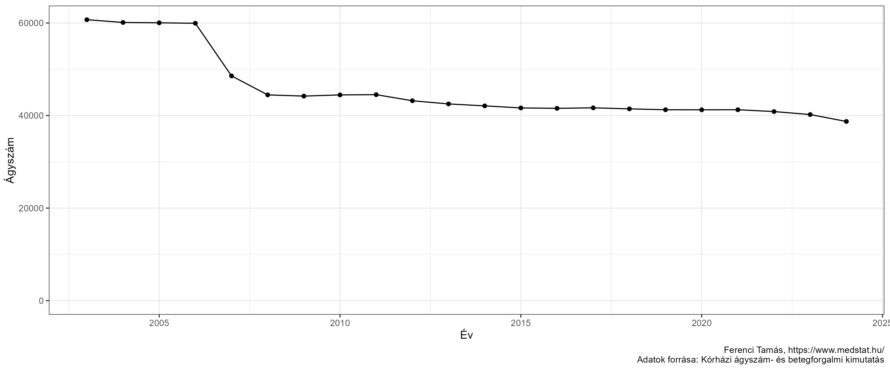<!-- -->

Az ábrán kékkel behúztam a pontokra legjobban illeszkedő, origón átmenő
egyenest. Ebből két dolog látszik: egyrészt, hogy a meredekség a már
emlegetett $\frac{365 \cdot AgyKihasznalas}{AtlApTartam}$ faktor:
amelyik szakmában meredekebb az egyenes, tehát adott ágyszámon több
beteget látnak el, ott vagy az ágykihasználás jobb, vagy az ápolási
időtartam rövidebb átlagosan (vagy mindkettő). Van azonban még egy
fontos dolog: a behúzott egyenes meredeksége az összes magyar kórház
*átlagát* adja meg, de érdemes a pontokat is nézni, mert azok szóródása
megmutatja, hogy ebben a két tényezőben – ágykihasználás és átlagos
ápolási idő – mekkora eltérések vannak az országban. Látható, hogy
például sebészetben nincs nagy szóródás, addig mondjuk kardiológiában
jóval nagyobbak az eltérések (van olyan osztály, Jahn Ferenc, ami 56
ággyal 1365 beteget látott el és van olyan, SOTE, ami 65-tel 9790-et).
Ez persze abból adódik jó eséllyel, hogy kardiológián belül is nagyon
mást csináltak (a különbséget az ápolási idő táplálja elsősorban, nem az
ágykihasználás: előbbiben ez átlagosan 8,0 nap, utóbbiban 1,8).

Nézzük meg most e két tényezőt külön-külön! Kezdjük az
ágykihasználással. Így néz ki a 2021-es helyzet:

``` r
ggplot(res[Ev==2021][MukodoAtlagAgy>0], aes(x = Agykihasznalas, y = SzakmaMegnev)) +
  geom_jitter(width = 0, height = 0.1) + scale_y_discrete(limits=rev) +
  labs(x = "Ágykihasználás [%]", y = "")
```

<!-- -->

Egyrészt látszanak a 100% feletti ágykihasználások, amit az
adatvalidálásról szóló pontban már érintettem. Az okát nem tudván ezt
most figyelmen kívül hagyom, így az látszik jól, hogy milyen különbségek
vannak az egyes szakterületek között.

Ez utóbbi aspektus talán még érdekesebbé tehető, ha az időbeli trendeket
is bevonjuk a vizsgálat tárgykörébe (minden halvány vonal egy kórház
adata, a vastag piros pedig az országos átlag adott szakmában):

``` r
ggplot(res[NemSpecKh==TRUE&NemSpecSzakma==TRUE&MukodoAtlagAgy>0],
       aes(x = Ev, y = Agykihasznalas, group = KorhazRovid)) +
    facet_wrap(~SzakmaMegnev, scales = "free") + geom_line(alpha = 0.2) +
    geom_line(data = res[NemSpecKh==TRUE&NemSpecSzakma==TRUE&MukodoAtlagAgy>0][
        ,.(Agykihasznalas = weighted.mean(Agykihasznalas, ElbocsatottBetegSzam)) , .(Ev, SzakmaMegnev)],
        aes(x = Ev, y = Agykihasznalas), inherit.aes = FALSE, color = "red")
```

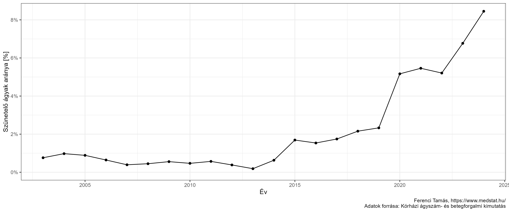<!-- -->

Ezt az ábrát is érdemes tanulmányozni. Tökéletesen látszik rajta a
koronavírus-járvány hatása (abban is, ahogy bizonyos osztályok, például
reumatológia kihasználása hogyan esett le, és abban is, hogy másoké,
mint az infektológia hogy ugrott meg). Jól látható, hogy a 2006/2007-es
reform, ha csak nagyon kicsit is, de helyenként tudta érzékelhetően
javítani az ágykihasználást. Ami a legfontosabb azonban az összkép:
egyrészt, hogy hol mekkora az ágykihasználás (mennyivel marad el a
100%-tól), valamint, hogy ebben mekkora szóródás van az egyes kórházak
között.

Ezen a ponton már ne kerülgessük tovább azt a kérdést, hogy ha a
kihasználtság az valamilyen hatékonysági mérőszám, akkor a 100%-e a cél?
Első látásra igen, hiszen egy kisebb kihasználás azt jelenti, hogy az
ágy üresen (feleslegesen) áll, miközben egy sor költséget így is
generál.

Ez valóban igaz, és csakugyan törekedni kell a hatékonyság, és így az
ágykihasználtság növelésére, de van több szempont, ami miatt a helyzet
ennyire azért nem egyszerű, és nem lehet cél a 100%. Az első probléma,
hogy bizonyos területeken, jellegükből adódóan fel kell készülni nagyon
hirtelen, semmilyen módon előre nem jelezhető betegszám-megugrásra, amit
el kell tudni látni. (Tömeges baleset, járvány-kitörés, időjárási
katasztrófa stb.) Tehát már csak ezért sem lehet 100%-ot megcélozni;
természetesen ez nagyon szakterület-függő, intenzív ellátásban sokkal
inkább lehet ilyenre szükség, reumatológián aligha. Ezt figyelembe kell
venni, amikor megítéljük az egyes szakmák ágykihasználását. (Valamelyest
igazából minden szakmánál kell ilyenre gondolni, például mert tartalékot
kell beépíteni arra az esetre is, ha egy kórházzal történik valami vagy
egy kiterjedt katasztrófa üt be, úgyhogy az egészségügy egészében is
kell legyen tartalék.) A következő problémakör a szezonalitás: bizonyos
betegségekből markánsan több van télen, mint nyáron, van amiből pont
fordítva, más esetben eltérhet hétvége és hétköznapi, nemzeti ünnep stb.
stb. A kórháznak erre is fel kell készülnie, hiszen ne feledjük, hogy az
ágykihasználás az egy – egész éves – *átlag*, miközben a betegeket nem
csak egy éves átlagban kell tudnunk elhelyezni, hanem minden nap.
Természetesen a szakirodalom, a historikus adatok tudnak segíteni ennek
megtervezésében. Végezetül pedig tekintettel kell lenni a hosszú távú
trendekre is: bizonyos területek esetszáma, ha csak lassan, évek alatt
is, de csökken, másoké nő. Lehet persze azt mondani, hogy ezt menet
közben állítjuk, és alapvetően tényleg ez a teeendő, de azért azt is
látni kell, hogy a kórházi ágyszám nem rettenetesen rugalmas, tehát
érdemes lehet némi tartalékot beépíteni az előre látható jövőbeli
változásokra is.

Térjünk most át az ápolási időre! Azt már láttuk, hogy az ápolási idő
csökkentése a technikai hatékonyságot növeli (tehát, azonos ágyszám
mellett több beteg ellátását teszi lehetővé rögzített idő alatt). Arról
is volt szó, hogy ez nem pusztán gazdasági kérdés, a betegnek is jobb,
természetesen, ha kevesebbet van kórházban. Ezt a technikai fejlődés is
elősegíti, de hozzá kell tenni, hogy Magyarországon sajnos néha a
finanszírozási érdekek ezt ellensúlyozzák. Vajon mi mindezek összhatása?

Elsőként nézzük meg itt is a 2021-es adatokat:

``` r
ggplot(res[Ev==2021][MukodoAtlagAgy>0], aes(x = ApolasAtlTartam, y = SzakmaMegnev)) +
  geom_jitter(width = 0, height = 0.1) + scale_y_discrete(limits=rev) +
  labs(x = "Átlagos ápolási időtartam [nap]", y = "")
```

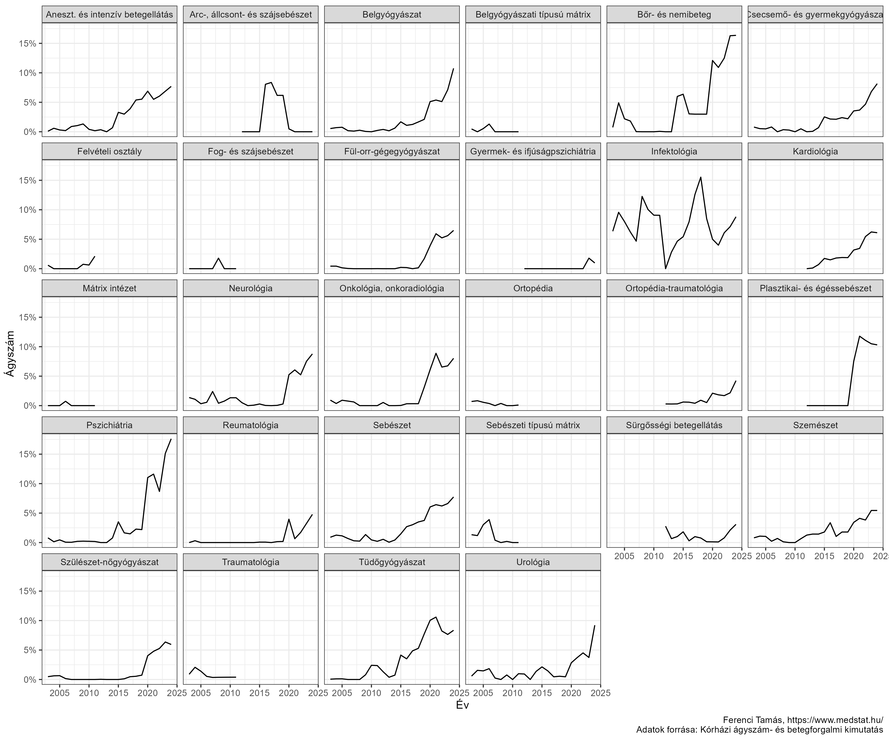<!-- -->

Jól látszanak a területenkénti eltérések, de ennyi adat alapján
mindössze két dolgot tehetünk: szakmai adatokhoz (irodalmi közlése,
nemzetközi összehasonlító adatok stb.) hasonlítjuk a számokat, illetve a
nagyon kilógó értékeket keressük meg, pusztán matematikai alapon. Ez
utóbbira egy későbbi adatsor kapcsán hozok példát, most nézzünk meg egy
másik lehetőséget: tekintsük át az időbeli trendeket is! Az alábbi ábrán
minden halvány vonal egy kórház adata, a vastag piros pedig az országos
átlag adott szakmában:

``` r
ggplot(res[NemSpecKh==TRUE&NemSpecSzakma==TRUE&MukodoAtlagAgy>0],
       aes(x = Ev, y = ApolasAtlTartam, group = KorhazRovid)) +
  facet_wrap(~SzakmaMegnev, scales = "free") + geom_line(alpha = 0.2) +
  geom_line(data = res[NemSpecKh==TRUE&NemSpecSzakma==TRUE&MukodoAtlagAgy>0][
    ,.(ApolasAtlTartam = weighted.mean(ApolasAtlTartam, ElbocsatottBetegSzam)) , .(Ev, SzakmaMegnev)],
    aes(x = Ev, y = ApolasAtlTartam), inherit.aes = FALSE, color = "red") +
  labs(x = "Év", y = "Átlagos ápolási időtartam [nap]")
```

<!-- -->

Ez szintén nagyon tanulságos ábra. Látszik, hogy vannak területek ahol
nem nagyon változott – ilyen szempontból – a helyzet az évek alatt, van
ahol sikerült érdemi csökkenést elérni (talán a szemészet erre a
leglátványosabb példa). Az is jól látható, hogy a 2006/2007-es reform el
tudta érni több területen is az ápolási időtartam érzékelhető
csökkenését: a fül-orr-gégészet, tüdőgyógyászat, szemészet,
szülészet-nőgyógyászat a legegyértelműbb példák erre.

## Felvezető helyett kitérő: gondolatok az egészségügyi teljesítmény méréséről

A magyar egészségügy egyik nagyon komoly, alapvető problémája véleményem
szerint a *transzparens teljesítménymérés* szinte teljes hiánya. Ez egy
teljesen külön írása tárgya lehetne, úgyhogy itt most semmi másra nem
szorítkozok, mint néhány címszó felvetésére.

A kérdés azért merül fel, mert a következő pontban a halálozási adatokat
fogom elemezni. Nagyon adja magát a gondolat, hogy ezzel az osztályok
teljesítményét mérjük (és most már tényleg a szokásos értelemben!),
hiszen ahol többen halnak meg mint más, ráadásul hasonló profilú
osztálynál, ott valami rosszabbul megy. Ez egy nagyon sok helyen
felbukkanó gondolkodási hiba, amelyet olyan fontosnak érzek, hogy
szeretném még az adatok bármiféle bemutatása előtt, külön is
megtárgyalni. Nem arról van szó, hogy ezek az adatok feltétlenül
„használhatatlanok”, de az alkalmazásuk – és értelmezésük – során nagyon
pontosan tisztában kell lennünk a limitációkkal.

Mielőtt belevágunk, kezdjük néhány szűkítéssel. Először is, az
egészségügyi teljesítmény több szinten is értelmezhető: egyik végpont
egy konkrét orvos teljesítményének a mérése, a másik az ország
egészségügyi rendszere egészének teljesítménymérése. A kettő között is
értelmezhető fokozat, ennek tipikus példája az, amit most fogunk
végezni: egy kórházi osztály teljesítményének a mérése.

Sok helyen kifejtettem, itt csak megismétlem: a teljesítmény mérése
alapvető szükséglete (lenne) annak, hogy bármiféle racionális
beavatkozással, megfelelő pozitív ösztönzőkkel tudjunk élni a
teljesítmény *javítása* érdekében. Addig, amíg nincs objektív és
transzparens teljesítménymérés, még csak arról sem lehet fogalmunk sem,
hogy egyáltalán hol végeznek jó munkát, és hol vannak problémák, nem
hogy arról, hogy mi a rossz teljesítmény, vagy mi a kiválóság oka. E
nélkül viszont aligha fogjuk tudni, hogy hol és hogyan avatkozzunk be,
hogy jobbá tegyük a helyzetet.

Félig kitérő megjegyzés: nem véletlenül használom – és hangsúlyozom –
minden lehetséges ponton a *transzparens* szót. Olyan teljesítménymérés,
amit csak beavatott szemek látnak, noha a semminél biztos jobb, de csak
a töredékét fogja tudni kihasználni a teljesítménymérésben lévő
potenciálnak. Ennek okait a járványügyi adatok közléséről [szóló
írásomban](https://github.com/tamas-ferenci/GondolatokAJarvanyugyiAdatokKozleserol)
részletesen kifejtettem, itt most csak vázlatosan ismétlem meg. Egyrészt
a teljesítménymérés fontos eszköz a lakosság bizalmának elnyerésében és
fenntartásában, ez értelemszerűen csak transzparens adatközlés esetén
valósítható meg. Hasonlóan fontos a minőségbiztosítás szempontja:
amennyiben nem transzparens a teljesítménymérés, akkor sokkal kisebb a
nyomás a javítás irányába, ha azonban az érintettek tudják, hogy erről a
közvélemény is értesül, akkor ez jellemzően már önmagában is nagyon jól
kikényszeríti a sokkal jobb minőségű munkát. Nem értek egyet azzal az
ellenérvvel, hogy „Minek az átlagembernek ez a sok adat? Úgysem tud vele
mit kezdeni!”. Azon túl, hogy minden állampolgár fizeti a
népegészségügyet, ezért azt gondolom, hogy joga van megismerni annak
minden adatát, ami más jogát nem sérti, de valóban tény, hogy a legtöbb
ember nem közvetlenül fogyasztja (fogyasztaná) ezeket az információkat.
Hanem hogyan? Szakértőkön, elemzéseken, kutatók analízisén keresztül.
Ezek megszületésének azonban feltétele, hogy legyenek adatok, amik
elemezhetőek! Az adatok visszatartása tehát igenis gond „az
átlagembernek” is, még akkor is, ha ő maga nem elemezné az adatokat,
mert azt is lehetetlenné teszi, hogy független szakértők elemzését
hallja. Ha viszont ilyen nem létezik, az nem egyszerűen gond, hanem
egyenesen életveszélyes, azért az, mert így nincs külső kontroll, és
emiatt sokkal kisebb az esélye, hogy a hibák kiderüljenek. Nagyon
fontos, hogy nem csak a szándékos csalásokról beszélek, ez a
legjóhiszeműbb, véletlen tévedésre is ugyanúgy vonatkozik. Soha,
semmilyen szakértő nem tud tévedhetetlen lenni, ezért baj, ha csak egy
szűk kör végez elemzéseket: minél több, független szemlélő van, annál
valószínűbb, hogy kiderüljenek a hibák, annál valószínűbb, hogy
felszínre kerüljenek új, jobb elemzési lehetőségek. Hogy így viszont
lehet olyan az elemzők között, aki téved? Hazudik? Érdekellentétből
kifolyólag hibás értelmezést tesz közzé? Hogyne! Csak így ez is
látszódni fog, hiszen a többi elemző e fölött is kontrollt jelent, míg a
jelenlegi rendszerben pontosan ugyanúgy megvan ennek a lehetősége, csak
így még ki sem derül! Végezetül nem értek egyet azzal az ellenérvvel
sem, hogy a teljesítménymérés adatainak a közlése veszélyes lehet,
például mert pánik törhet ki az adatok láttán. Közhelyszámba megy, de
azt gondolom, hogy az ismeretlentől félünk legjobban: kevés dolog
gerjeszt jobban pánikot, mint a kézen-közön terjedő rémhírek, sajtóbeli,
ki tudja mennyire reprezentatív híradások (ez a helyzet jelenleg) és
kevés dolog hat megnyugtatóbban, mint a valós adatok megismerése – ha
megvan a bizalom az adatok hitelességében; és ezzel vissza is
kanyarodtunk az első ponthoz. Arra természetesen, épp emiatt, vigyázni
kell, hogy az adatokat csak kellő alaposságú előzetes ellenőrzés,
adattisztítás után közöljük. Azt pedig, hogy az adatokat majd
„félreértik”, pont egy őszinte, partnerként kezelő kommunikációval,
közérthető magyarázatokkal lehet a leginkább megelőzni. Igen, eleinte
félre fogják érteni, társadalmi vita fog indulni, ebbe be kell szállni,
ami munkaigényes lesz, de a valódi eredmények elérése már csak ilyen.
Aztán a dolog tisztázódni fog, megértik a teljesebb képet (amit
mellesleg a népegészségügyi rendszer is segíthet, megfelelő –
értelmezést tartalmazó, segítő, kontextust is bemutató –
adatközléssel!), és egyszer csak azt fogjuk látni, hogy elkezdik helyén
kezelni az adatokat. Igen, az átmeneti periódus sok feladattal fog
járni, de ez egy klasszikus példa a hosszú és rövid távú szempontok
ütközésére. Ha állandóan attól rettegünk, hogy rövid távon rosszabb
lesz, akkor soha nem fogunk előrébb lépni, és az ez által okozott kár
végeredményben nagyobb lesz, mint amennyi a veszteség rövid távon.

Másodszor, az egészségügyi teljesítmény egy sokdimenziós fogalom, kezdve
azzal, hogy egyáltalán mit mérjünk. Ez tényleg egy teljesen más írás
témája lehet, úgyhogy itt csak egy mondattal utalok arra, hogy a talán
legnépszerűbb gondolkodási keret a [donabedian-i
modell](https://www.ncbi.nlm.nih.gov/pmc/articles/PMC2690293/): ebben
struktúra-, folyamat- és kimeneti indikátorokat különböztetünk meg.
(Mondjuk az alsó végtagi érbetegek ellátásában struktúra indikátor az
érsebészek száma, folyamat indikátor az elvégzett végtagmentő
beavatkozások száma, kimeneti indikátor az amputációs ráta.) E keretek
végiggondolása nem könnyű kérdés, de mutatja, hogy valójában minden
teljesítménymérés első lépése: *meg kell érteni a minőség fogalmát az
egészségügyi ellátásban*.

Harmadszor, még ha meg is szorítjuk magunkat a kimeneti indikátorokra,
és a továbbiakban csak ezzel foglalkozunk, az egészségügyi teljesítmény
akkor is, még e téren belül is sokdimenziós fogalom. Ezt azért is
hangsúlyozom, mert bár itt, ahogy azt előre is bocsátottam,
halálozásokról lesz, a valós értékelésnek számos egyéb szempontra ki
kell terjednie. Nem csak arról van szó, hogy aligha használhatjuk a
halálozási arányt mérőszámként mondjuk egy szemészeti vagy
gyermeknőgyógyászati osztálynál (jó esetben), hanem, hogy ahol érdemi a
halálozás, ott sem *csak* ez számít. Fontos lehet ugyanúgy a beteg
későbbi életminősége, a fertőződési vagy reoperációs ráták, rövid- és
hosszútávú szövődmények előfordulásai, és így tovább. Összességében véve
tehát nem arról van szó, hogy ez jó vagy sem, hanem, hogy nem várható,
hogy *egyetlen* mutató, legyen az bármilyen jó is, teljeskörűen le tudja
írni a teljesítményt. És akkor még nem beszéltünk arról, hogy a
komponensek is érdekesek lehetnek, például külön az ápolási teljesítmény
mérése. Mindezekre vannak jól bevált megoldások, még külön nemzetközi
szervezet is létezik ([ICHOM](https://www.ichom.org/)), mely az ilyen
kimeneti indikátorokat vizsgálja, strukturálja és elkészíti az erre
vonatkozó részletes, megvalósítást is támogató ajánlásait, melyeket –
ingyen – elérhetővé is tesz (itt vannak például az ajánlásaik
[pitvarfibrillációhoz](https://academic.oup.com/eurheartj/article/41/10/1132/5717382)
vagy épp
[tüdőrákhoz](https://erj.ersjournals.com/content/erj/48/3/852.full.pdf)).

Megjegyzem, hogy valójában még a „halálozás” sem feltétlenül olyan
egyértelműen definiált fogalom, mint azt az ember elsőre gondolhatná. Az
számít, hogy a kórházban halt meg (de van, aki egy-két napot van bent,
van aki több hetet!), vagy fixen mondjuk harminc napon belül? Az adott
osztályon halt meg, vagy ha áthelyezték más osztályra és ott, azt is az
eredeti osztály halálozási rátájához számoljuk? Csak az okspecifikus
halálozást nézzük, vagy a bármely okból bekövetkező halálozást? Ezek
technikai kérdések, csak rá akartam világítani, hogy ezeknek a
tényezőknek is nagy jelentőségük van a végeredmény szempontjából.

Térjünk azonban most rá a legfontosabb problémára.

Legyen a vizsgált indikátorunk a halálozás, félretéve minden korábban
felsorolt fenntartást. Az egyik kórházban a betegek 4%-a hal meg egy
adott műtétet követő 30 napon belül, a másikban 6%-a. Ha teljesen a mi
döntésünk lenne, akkor hova menjünk megoperáltatni magunkat?

A válasz az, hogy természetesen ez utóbbiba!

A helyzet ugyanis az, hogy nagyon sokszor az történik, hogy a legjobban
felkészült, legmagasabb szintű intézmények gyűjtik be a legkomplikáltabb
eseteket (épp azért, mert ők a legmagasabb szintűek), amiknél –
bármilyen jól is operálnak – nem lehet túl szívderítő eredményt elérni.
Az összesített statisztikájukat viszont ez le fogja rontani; akár még az
is előfordulhat, hogy *minden* súlyosságban jobb az egyik kórház, de
*összességében* mégis rosszabb! Hogy ez matematikailag lehetetlen lenne
(ahogy talán sokan gondolják e ponton)…? Közel sem! Vessünk egy
pillantást erre a táblázatra; az egyszerűség kedvéért a
betegség-súlyosság most legyen kétfokozatú:

|                         | X kórház         | Y kórház        |
|-------------------------|------------------|-----------------|
| Enyhe állapotú betegek  | 2% (100/5000)    | 3% (85/2800)    |
| Súlyos állapotú betegek | 10% (500/5000)   | 17% (34/200)    |
| *Összességében*         | *6% (600/10000)* | *4% (119/3000)* |

A zárójelben lévő szám mutatja, hogy az adott kategóriában hány beteg
volt, és közülük hány halt meg, így adódik ki a zárójel előtti
halálozási arány. Amint látjuk, X kórház jobb az enyhe állapotú betegek
műtétjeinél, *és* jobb a súlyos állapotúaknál… összességében viszont
mégis rosszabb! A táblázatból azonban már látszik, hogy itt csakugyan
semmi ellentmondás vagy paradoxon nincs: egyszerűen az történik, hogy a
súlyosabb állapotúak műtétjeinél rosszabb a halálozási arány, és X-nél
ez teszi ki a betegek felét, míg Y csak mutatóban operál ilyet. Így
hiába is jobb X mindkét betegcsoportban, az össz-eredménye rosszabb lesz
a rengeteg súlyos állapotú betege miatt.

Hát ezért nem lehet egyszerűen a halálozási adatokat összevetni: számít
a „bemenő-oldal”, a betegösszetétel is! (Természetesen az eredeti
mondatom kicsit túl provokatív volt: éppenséggel *lehet*, hogy a 4%-os
halálozási arányú kórházba érdemes menni, csak – mint ez a példa is
rámutat – ez nem következik abból, hogy a 4 kisebb mint a 6.) Azaz, ha
teljesítményt akarunk korrekten mérni, ezt valahogy figyelembe kell
venni. Ebben az írásban most nem térek erre ki, mindenesetre léteznek
erre megfelelő módszerek, de az biztos, hogy ehhez adattal kell
rendelkeznünk a betegek rizikójáról (például életkoráról, neméről,
társbetegségeiről, betegségstádiumról stb.). A fontos most az, hogy erre
vannak jól bevált statisztikai módszerek.

Ez egy konkrét példa a *confoundingnak* nevezett általános jelenségre:
amikor úgy hasonlítunk össze csoportokat, hogy azok nem *csak* az
összehasonlítás szempontjában térnek el, és innentől kezdve, ha találunk
is különbséget a kimenetben, nem tudhatjuk, hogy az mennyiben a vizsgált
szempont hatása, és mennyiben az egyéb eltéréseké. Azt gondolom, hogy a
teljesítményértékelésre (is!) igaz, hogy nem csak annak fontos [ezt a
kérdéskört
ismernie](https://tamas-ferenci.github.io/FerenciTamas_AzOrvosiMegismeresModszertanaEsAzOrvosiKutatasokKritikusErtekelese/),
aki a számokat gyártja, hanem mindenkinek hasznos, aki ilyen
eredményeket olvas. Egy [korábbi
írásomban](https://github.com/tamas-ferenci/GondolatokAJarvanyElleniVedekezesErtekeleserolEsAJarvanyHatasanakVizsgalatarol)
megtalálható egy nagyon hasonló kérdéskör részletes elemzése.

A jól bevált nyugati példákat a teljesítménymérésre vonatkozóan
nagyjából a végtelenségig lehetne sorolni, itt most talán csak Angliát
hoznám fel. Érdemes megnézni, hogy [milyen
jelentést](https://researchbriefings.files.parliament.uk/documents/CBP-7281/CBP-7281.pdf)
tesznek közzé minden egyes hónapban, hogy milyen elképesztő mennyiségű
[adatot közölnek](https://digital.nhs.uk/data) általában is, [részletes
elemzésekkel](https://digital.nhs.uk/data-and-information/data-insights-and-statistics),
de hogy közeledjünk a teljesítménymérés kérdéséhez, három dolgot érdemes
külön is megnézni. Az egyik a [statisztikai
munkaterületek](https://www.england.nhs.uk/statistics/statistical-work-areas/)
elnevezését viseli, végigmondani is hosszú lenne, hogy milyen minőségi
indikátorokat lehet – természetesen nyilvánosan, bárki számára –
letölteni. Hazai szemmel nézve egészen elképesztő (elszomorító), hogy
simán
[megnézhetem](https://www.england.nhs.uk/statistics/wp-content/uploads/sites/2/2022/07/AmbSYS-time-series-up-until-20220630-v3.xlsx),
hogy júniusban 79 436 legmagasabb sürgősségi fokozatba sorolt
mentőszolgálati hívásuk volt, az átlagos idő a kiérkezésig 9 perc 6
másodperc volt, de az ilyenek 90%-ához odaértek 16 perc 3 másodpercen
belül, megtekinthető, hogy az egyes hívásoknak mi lett a sorsa
(helyszíni ellátás elég volt, szállítás sürgősségi betegellátó
osztályra, szállítás más osztályra stb.), hogy átlagosan mennyi
erőforrást – például mentőautót – kellett a helyszínre küldeni, hányszor
volt szükség újraélesztésre stb., a nyers számokhoz
[elérhetőek](https://www.england.nhs.uk/statistics/wp-content/uploads/sites/2/2022/07/20220714-AQI-Stats-Note.pdf)
magyarázattal ellátott vizualizációk, idősoros grafikonok, letölthető a
– 2023-ig előre megadott – [adatközlési
naptár](https://www.england.nhs.uk/statistics/wp-content/uploads/sites/2/2022/02/2022-23-AQI-Publication-Timetable-2.pdf),
természetesen részletes
[adatspecifikációkkal](https://www.england.nhs.uk/statistics/statistical-work-areas/ambulance-quality-indicators/),
egészen
[addig](https://www.england.nhs.uk/statistics/wp-content/uploads/sites/2/2018/07/20180525-Ambulance-System-Indicators-specification.pdf),
hogy mit jelent az, hogy átlag (összes idő osztva az események
számával), vagy, hogy mikor indul az óra a kiérkezési idő méréséhez (a
hívás kódolásakor vagy az első erőforrás hozzárendelésekor, amelyik
hamarabb megtörténik, de legkésőbb a hívás kapcsolását követő 30
másodperccel). *És még csak a mentőszolgálat teljesítménymérése volt…*!
Vajon mi mikor fogunk ide eljutni?

Másodsorban, érdemes megnézni a
[betegségauditokat](https://digital.nhs.uk/data-and-information/data-insights-and-statistics/audits-and-registries-team),
egészen elképesztő mélységű adatok találhatóak a betegségekről
(regiszter jelleggel – erről is lehetne Magyarországon beszélni…), de az
ellátás teljesítmény-jellemzőiről is. Érdemes megnézni mondjuk a
vastagbél-rák audit [oldalát](https://www.nboca.org.uk/), részletes
tájékoztatók orvosoknak, betegeknek; [így néz
ki](https://www.nboca.org.uk/content/uploads/2022/02/NBOCA-2021-AR-Final.pdf)
például egy éves jelentés: betegút-elemzés, betegösszetétel-elemzés,
különböző műtéti és gyógyszeres kezelések alkalmazásának gyakoriságai
kórházanként lebontva, halálozási adatok kórházanként, kórházi ápolási
idők megoszlása területenként, további minőségi mutatók (előre nem
tervezett kórházi újra-felvételek aránya kórházanként), alkalmazott
sebészeti technikák megoszlása és így tovább, és így tovább. Minden
pontnál ajánlások, és az egész audithoz [külön
rovat](https://www.nboca.org.uk/quality-improvement/) a
minőségfejlesztéshez.

Az angoloknál annak is kialakított módszertana van, hogy az egyes
orvosok egyéni teljesítményét [hogyan
értékelik](https://www.england.nhs.uk/professional-standards/medical-revalidation/appraisers/),
ezt is érdemes megnézni, szintén minden részletében pontosan
szabályozott. Ott ez egy alapkő, feltétele, hogy meghosszabbítsák az
orvos engedélyét.

Általában is igaz, hogy a fenti munka elvégzéséhez minden szükséges
tudás és módszertan rendelkezésre áll. A végtelenül bőséges angol nyelvű
szakirodalmon túl hazai műhelyek is foglalkoztak a kérdéssel, az
Egészségügyi Gazdasági Szemle nevű szaklap két részben ([1.
rész](https://weborvos.hu/adat/files/2012_szeptember/egsz21.pdf), [2.
rész](https://weborvos.hu/adat/files/2012_szeptember/egsz22jo.pdf))
tette közé 2012-ben a legfontosabb hazai eredményeket, a Magyar Orvosi
Kamara 2020 végén egy teljes
[javaslatot](https://mok.hu/public/media/source/Transzparencia/Bedolgozas/A%20MOK%20javaslata%20az%20eg%C3%A9szs%C3%A9g%C3%BCgyi%20szolg%C3%A1ltat%C3%B3k%20min%C5%91s%C3%A9gi%20indik%C3%A1torrendszer%C3%A9nek%20kialak%C3%ADt%C3%A1s%C3%A1ra.pdf)
tett le az asztalra. Az már más kérdés, hogy látható eredmény mindezek
ellenére nincsen.

Egy mondatban összefoglalva: meg kell érteni a minőségi fogalmát az
egészségügyi ellátás keretében, azonosítani kell a területeit,
lefordítani mindezt konkrét mutatókra, megkezdeni azok szisztematikus
mérését, a megfelelő statisztikai eszközökkel korrigálni a
betegjellemzőkre (amiket tehát szintén mérni kell), és ez alapján
objektív teljesítményjellemzőket kell számolni, majd azokat
transzparensen közölni. Meggyőződésem, hogy e nélkül nehezen képzelhető
el az egészségügy igazán hatékony, lehetőségeinket kihasználó
fejlesztése, viszont másik oldalról mindez nem lenne nehéz: az adatok
összegyűjtése – pláne a mai informatikai lehetőségek mellett – sokkal
inkább szándék, semmint pénz kérdése, módszertani oldalról pedig minden
adott, a megoldások léteznek, csak alkalmazni kell őket.

Magyarországon nagyon kevés példa van a fenti folyamatra, jószerével az
egyetlen amit fel tudok idézni, mint ami megpróbált átfogó lenni és az
eredményeit is transzparensen közzétette a nyilvánosságnak, az az
egykori Egészségbiztosítási Felügyelet
[indikátorrendszere](https://web.archive.org/web/20100821180551/http://ebf.hu/letoltes/Indikator2010_gyorsjel_v1.0.pdf),
mely nagyon jó első lépés volt: [bárki számára
elérhetően](https://web.archive.org/web/20090805125845/http://indikator.ebf.hu:80/)
tartalmazta az intézmények indikátorait, szakterületenként lebontva
(például kardiológiához 55 indikátor volt, szülészethez 80 stb.),
szűrhetően régió, település és intézmény alapján, teljesen
testreszabhatóan (még saját indikátorrendszert, vagy egyéni rangsort is
lehetett gyártani). De mértek struktúra jellegű indikátorokat is,
vizsgálták az egészségügyi dolgozók helyzetét, figyeltek betegbiztonsági
mutatókat, a kórházi minőségfejlesztés működését; összesen [791
indikátort](https://www.imeonline.hu/article.php?article=2011._X./98/az_interneten_elerheto_minosegugyi_informaciok_szerepe_a_betegtajekoztatasban_tanulsagok_a_minosegi_indikatorrendszer_eddigi_mukodese_alapjan)
definiáltak, mértek és közöltek transzparensen.

Az EBF-et 2007-ben hozták létre, 2010 nyarán megszüntették – miután
előtte az akkori ellenzék, erre az egy példára konkrétan is emlékszem,
„kismamák ultrahang nélkül” szalagcímeket futtatott, melyben az *EBF
adatai alapján* mutatták be, hogy hány terhesgondozóban nincs ultrahang.
Majd ezek után hatalomra kerültek, és azonnal megszüntették az EBF-et.
Anélkül, hogy bárki átvette volna az indikátorrendszeri funkcióit. (Még
arra is volt gondjuk, hogy a honlapját is felszámolják, hogy még nyoma
se maradjon meg annak, hogy egyszer valaha ilyen indikátorrendszer
létezett Magyarországon. Valószínűleg már nem vagyunk sokan, akik
egyáltalán emlékeznek arra, hogy a teljesítménymérés hiánya, a
transzparencia hiánya nem valamiféle leküzdhetetlen átok a világ ezen
táján, és hogy ebben az országban megvan a tudás, a tehetség, a
szorgalom és a lelkesedés, hogy egy ilyen rendszer létrejöjjön, és
szolgálja a magyar egészségügy fejlődését. Csak kell hozzá a politika
támogatása.)

Számomra egyébként pont ez a szomorú ebben a történetben, hogy mutatja,
hogy amiket korábban leírtam, azok nem papíron nagyon jól hangzó, de
gyakorlatban, Magyarországon kivihetetlen fantáziák, nem elméleti
okoskodás, ami úgyis megvalósíthatatlan: itt az élő példa, hogy
megcsinálták, egy maroknyi csapat, egy gazdasági és politikai válság
közepén, minimális pénzből. (Az egész EBF-nek az utolsó teljes évében
500 millió forint körüli volt a költségvetése, miközben a
teljesítménymérésen túl kezelték többek között a teljes
várólista-nyilvánosságot, ellátták a gyógyszerpiac és az
egészségpénztárak felügyeletét és évi mintegy 2000 betegjogi ellenőrzést
folytattak le. Ez utóbbi miatt lejáratták és gáncsolták is érte eleget
azok a hatalmasságok az egészségügyben, akik nem voltak hozzászokva
ahhoz, hogy fiatal, az egészségügyi hierarchiába nem beletört ellenőrök
érkeznek bejelentés nélkül az intézményükbe.)

És mindezt 12 évvel ezelőtt. 12 év telt az EBF megszüntetése óta, és
azóta nemhogy a 12 évvel ezelőtti lehetőségeket nem sikerült újra
elérni, de még csak a leghalványabb nyoma sincs ilyen – pláne nyilvános,
teljesen transzparens – indikátorrendszernek. A NEAK jelenlegi
„indikátorrendszere” 3 (azaz három) [mutatóból
áll](http://neak.gov.hu/felso_menu/szakmai_oldalak/gyogyito_megeleozo_ellatas/szakellatas/fekvobeteg_szakellatas_minosegi_indikator):
az említett születésszám kiegészítve a császármetszések számával, az
egynapos sebészeti ellátások aránya és a várólisták hossza; mindez
közölve egy-egy PDF formátumban kimentett Excel-táblában.

2019 végén született egy
[kormányhatározat](http://www.kozlonyok.hu/nkonline/MKPDF/hiteles/MK19217.pdf),
mely ezt előírta volna, majd 2021 legvégén megjelent [egy újabb
jogszabály](http://www.kozlonyok.hu/nkonline/MKPDF/hiteles/MK21229.pdf),
ezúttal már kormányrendelet, nem kormányhatározat. Ennek jóságát és
működőképességét megítélni lehetetlen, hiszen a szöveg egy teljes
általánosságokban fogalmazó keretszabály. Akármi is sül ki belőle, az
egész biztosan elkeserítő, hogy a transzparencia még elvileg sem
követelmény: a jogszabály külön említi, hogy az „átláthatóság érdekében”
– csak épp az indikátorokat és azok számítását teszi kötelezően
nyilvánosan közlendővé, nem magukat az eredményeket! (Lehet, hogy jót
tett volna, ha a szakmai szervezetek nem egy (!) napot kapnak a tervezet
[véleményezésére](https://mok.hu/public/media/source/Transzparencia/Allasfoglalasok/EMMI_egyeztet%C3%A9s_fekv%C5%91beteg_ell%C3%A1t%C3%A1s%20min%C5%91s%C3%ADt%C3%A9s_0407.pdf)…
Miután 12 évig nem történt semmi.)

## Halálozási adatok

A fenti limitációk remélem nagyon egyértelművé tették, hogy az ágyszám-
és betegforgalmi kimutatásban szereplő adat (kórház és
szakmaosztályonkénti halálozás) *nem* teszi lehetővé érdemi
teljesítményvizsgálat elvégzését. Mindazonáltal a többitől lényegesen
eltérő adatok, valamint az időbeli trendek még így is érdekesek
lehetnek.

Elsőként nézzük meg, hogy hogyan alakult 2021-ben a kórházi halálozás,
szakmaosztályonként lebontva:

``` r
ggplot(res[Ev==2021][MukodoAtlagAgy>0], aes(x = Halalozas, y = SzakmaMegnev)) +
  geom_jitter(width = 0, height = 0.1) + scale_y_discrete(limits=rev) +
  labs(x = "Halálozási arány [%]", y = "")
```

<!-- -->

Első ránézésre elég logikus az ábra, ha a különböző szakmákra gondolunk,
de azért vannak meglepő dolgok is. Például mik azok a pontok jobb szélen
a sürgősségi betegellátásnál? Csakugyan, a 1603-as kódú karcagi Kátai
Gábor Kórház sürgősségi osztálya elvileg 83 beteg látott el (egész évben
összesen!), ami önmagában is hihetetlen, de ami még inkább az, hogy a
statisztika szerint közülük 83 meghalt! Nem sokkal jobb – elvileg – a
helyzet a ceglédi Toldy Ferenc Kórház (13B2) SBO-ján: 58 ellátott beteg
az évben, közülük 53 meghalt. Nem tudom mi e jelenség oka, de szinte
biztosnak tűnik, hogy valamiféle adminisztratív hiba áll a hátterében.
(A harmadik legnagyobb halálozási adat is „csak” 64%-os, és intenzív
osztályról került ki, ami máris sokkal hihetőbb.)

Ennél finomabb elemzést igényel, de azért vannak még meglepő dolgok az
ábrán. Ugyanazt a lépést kell megtennünk a korrekt elemzés érdekében itt
is, mint korábban: a saját szakmacsoporthoz kell viszonyítani! Példának
okáért a fül-orr-gégészet legnagyobb halálozása összességében nem
kiugró, de a saját szakmájához képest nagyon is. Konkrét számokkal: a
Kiskunhalasi Semmelweis Kórház (N590) fül-orr-gégészetén 2021-ben 17,1%
volt a halálozás, miközben a *második legrosszabb* érték 3,8%…!

Már itt hangsúlyozom, illetve megismétlem, hogy ilyen adatokból *nem*
lehet kórházi teljesítményre következtetni. Ahogy korábban is leírtam,
*elvileg* még az is lehetne, hogy a 17%-os halálozási kórház nyújtja a
legjobb teljesítményt (ha extrém komplikált eseteket látna el).
Mindazonáltal a dolog rendkívül gyanús, meglepő lenne, ha *ennyire*
extrém különbség lennének a betegösszetételben (pláne úgy, hogy a
kiskunhalasi kórház gyűjtené be a nagyon nehéz eseteket, szemben az
egyetemi klinikákkal?!) Úgy is elmondható a helyzet, hogy a 43 magyar
fül-orr-gégészeti osztályból 42-nek a halálozási aránya benne van a 0-4%
tartományban – a 43.-nak meg 17%? Ez mindenképpen magyarázatot igényel;
én sajnos nem tudtam rájönni, hogy mi lehet a háttérben.

A fenti okfejtés is mutatja, hogy a halálozási adatok mire
használhatóak: (betegösszetételi adatok híján) teljesítménymérés helyett
inkább amolyan „anomália-detekcióról” beszélhetünk.

Még egy módon érdemes ábrázolni az adatokat: nézzük meg csak a
fül-orr-gégészetek halálozásait (az áttekinthetőség és a kellő
statisztikai megbízhatóság miatt csak azokat az osztályokat tüntetem
fel, ahol legalább 30 beteget elláttak):

``` r
ggplot(res[Ev==2021][SzakmaMegnev=="Fül-orr-gégegyógyászat"&ElbocsatottBetegSzam>30&MukodoAtlagAgy>0][
  , .(Halalozas, KorhazNev,
      t(Vectorize(function(x, n) binom.test(x, n)$conf.int*100)(MeghaltBetegSzam, ElbocsatottBetegSzam)))],
       aes(x = Halalozas, xmin = V1, xmax = V2, y = KorhazNev)) + geom_point() + geom_errorbar(size = 0.5) +
  labs(x = "Halálozási arány [%]", y = "")
```

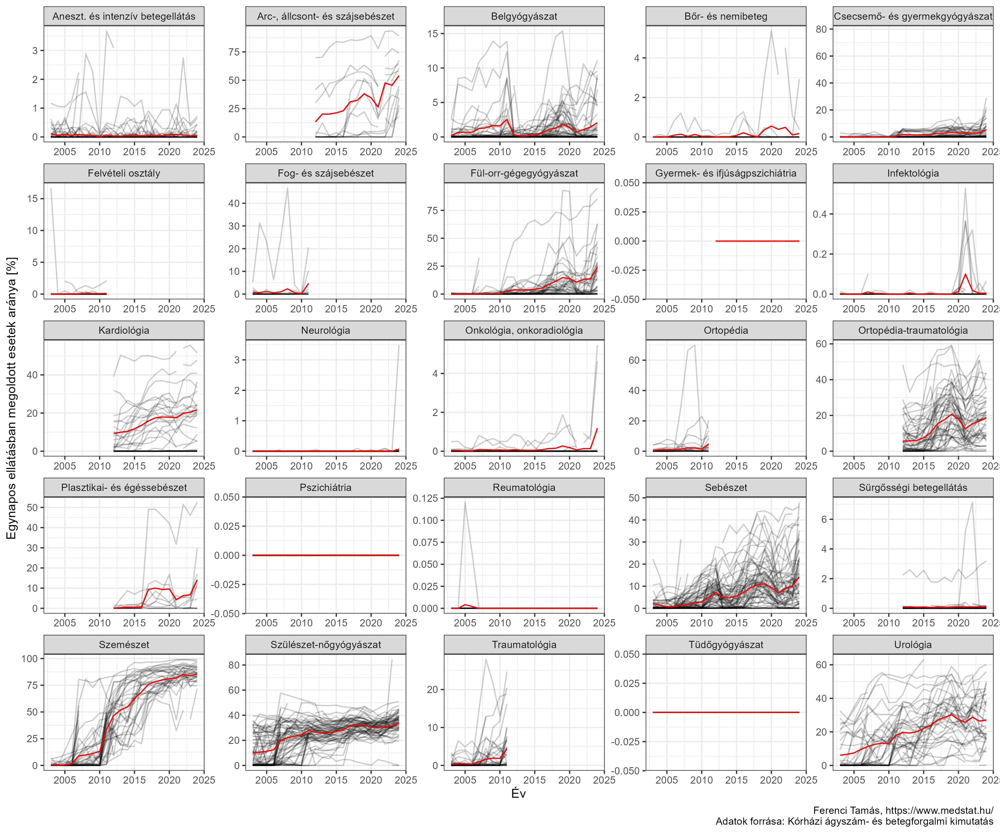<!-- -->

A vízszintes sávok az úgynevezett 95%-os konfidenciaintervallumok.
Leegyszerűsítve: azt jelzik, hogy a véletlen ingadozás miatt mekkora
bizonytalanság van a közölt számban. Mi az, hogy véletlen ingadozás?
Mondjuk, hogy egy adott osztály halálozása pontosan 50%. (Ez semmit nem
mond az osztály teljesítményéről, hiszen ha a beteg olyan állapotban
vannak, hogy máshol 60% lenne, akkor ez jó, ha egyébként 40% lenne,
akkor rossz, de most nem ez lesz számunkra az érdekes.) Ez akkor azt
jelenti, hogy kívülről nézve a dolog olyan, mintha minden beteg
gyógyulása egy *szabályos* pénzérme feldobásának az eredménye lenne. (Ez
elég szörnyen hangzik, mert rossz csengése van annak, hogy
„véletlenszerű”, hogy meggyógyulok-e, de újra mondom, ez akár jó hír is
lehet – ha egyébként 60% lenne a halálozási arány.) Kérdés: vajon hány
beteg fog meghalni, ha 100-at láttak el egy év alatt? Az ember hajlamos
rávágni, hogy 50 (hiszen 50% a halálozási arány), de legyünk
óvatosabbak: ha feldobunk egy szabályos pénzérmét 100-szor, biztos, hogy
pont 50 fejet kapunk? Természetesen nem, simán lehet 49 vagy 51, akár
még 45 vagy 55 is – noha a pénzérme tökéletesen szabályos volt. Hát ez a
véletlen ingadozás. Nekünk a dolog igazán fordítva lesz érdekes: ha 100
betegből 45 halt meg, akkor még nem biztos, hogy 45/100 = 45% a valódi
halálozási arány, hiszen épp az előbbi példa mutatja, hogy éppenséggel
akár 50% is lehet. Ezért mondhatjuk, hogy a kapott számban
bizonytalanság van: igen, 100-ból 45 halála esetén 45% a legjobb
tippünk, de ez nem biztos, a valóság lehet kicsit nagyobb vagy épp
kisebb is. A konfidenciaintervallum ezt adja meg: mik azok a valódi
értékek, amelyek mellett még „kényelmesen” (megfelelően definiált
értelemben) kaphattuk azt, pusztán a véletlen ingadozás miatt, amit
ténylegesen kaptunk is. Mondhatjuk, hogy ezek azok a valódi halálozási
arányok, amik kompatibilisek a kapott számmal.

Ez jelen esetben azért is fontos, mert felmerülhetne, hogy esetleg abban
a kórházban csak azért jött ki az extrém eredmény, mert nagyon kevés
beteg volt, ami miatt a véletlen ingadozás nagy – a
konfidenciaintervallum széles – és így pusztán a véletlen szeszélye
folytán halt meg sok beteg. Elvégre ha 100% a halálozási arány, de úgy,
hogy 1 beteget láttak el és az pont meghalt, az még nem nagyon aggasztó,
annyira mindenesetre biztosan nem, mintha 1000 ellátott beteg mellett
lenne ennyi a halálozási arány. A konfidenciaintervallum ezt szűri ki,
de láthatjuk, hogy igazán ezzel sem vagyunk beljebb: a kiskunhalasi
kórház így is extrém kilógó.

Hasonló a helyzet a bőrgyógyászatnál:

``` r
ggplot(res[Ev==2021][SzakmaMegnev=="Bőr- és nemibeteg"&ElbocsatottBetegSzam>30&MukodoAtlagAgy>0][
  , .(Halalozas, KorhazNev,
      t(Vectorize(function(x, n) binom.test(x, n)$conf.int*100)(MeghaltBetegSzam, ElbocsatottBetegSzam)))],
  aes(x = Halalozas, xmin = V1, xmax = V2, y = KorhazNev)) + geom_point() + geom_errorbar(size = 0.5) +
  labs(x = "Halálozási arány [%]", y = "")
```

<!-- -->

Vagy épp a pszichiátriánál:

``` r
ggplot(res[Ev==2021][SzakmaMegnev=="Pszichiátria"&ElbocsatottBetegSzam>30&MukodoAtlagAgy>0][
  , .(Halalozas, KorhazNev,
      t(Vectorize(function(x, n) binom.test(x, n)$conf.int*100)(MeghaltBetegSzam, ElbocsatottBetegSzam)))],
  aes(x = Halalozas, xmin = V1, xmax = V2, y = KorhazNev)) + geom_point() + geom_errorbar(size = 0.5) +
  labs(x = "Halálozási arány [%]", y = "")
```

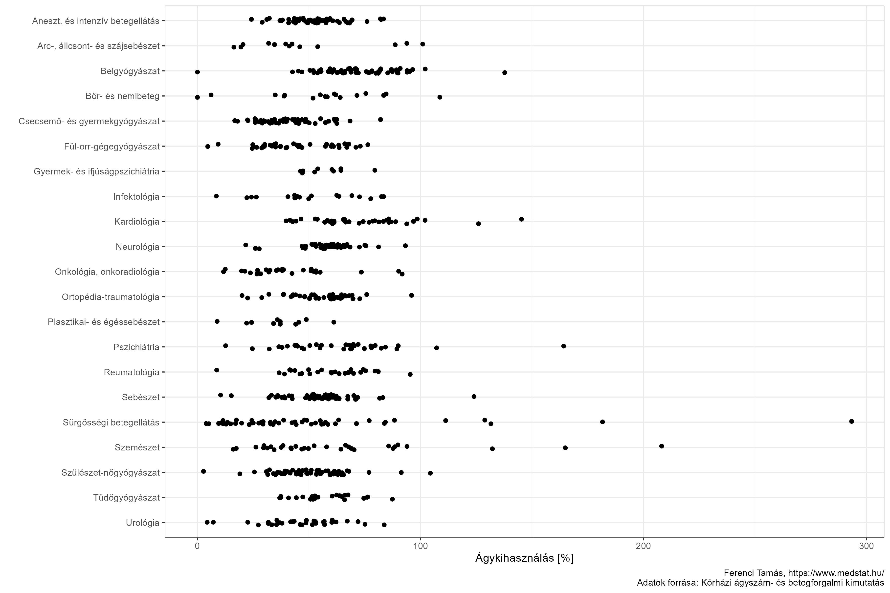<!-- -->

A sok szakma miatt kevésbé áttekinthető, de azért megnézhetjük az
összeset egyben is (vigyázzunk, hogy a vízszintes tengely skálázása mind
különböző!):

``` r
ggplot(res[Ev==2021][ElbocsatottBetegSzam>30&MukodoAtlagAgy>0][
  , .(Halalozas, KorhazRovid, SzakmaMegnev,
      t(Vectorize(function(x, n) binom.test(x, n)$conf.int*100)(MeghaltBetegSzam, ElbocsatottBetegSzam)))],
  aes(x = Halalozas, xmin = V1, xmax = V2, y = KorhazRovid)) + facet_wrap(~SzakmaMegnev, scales = "free") +
  geom_point() + geom_errorbar(size = 0.5) + labs(x = "Halálozási arány [%]", y = "")
```

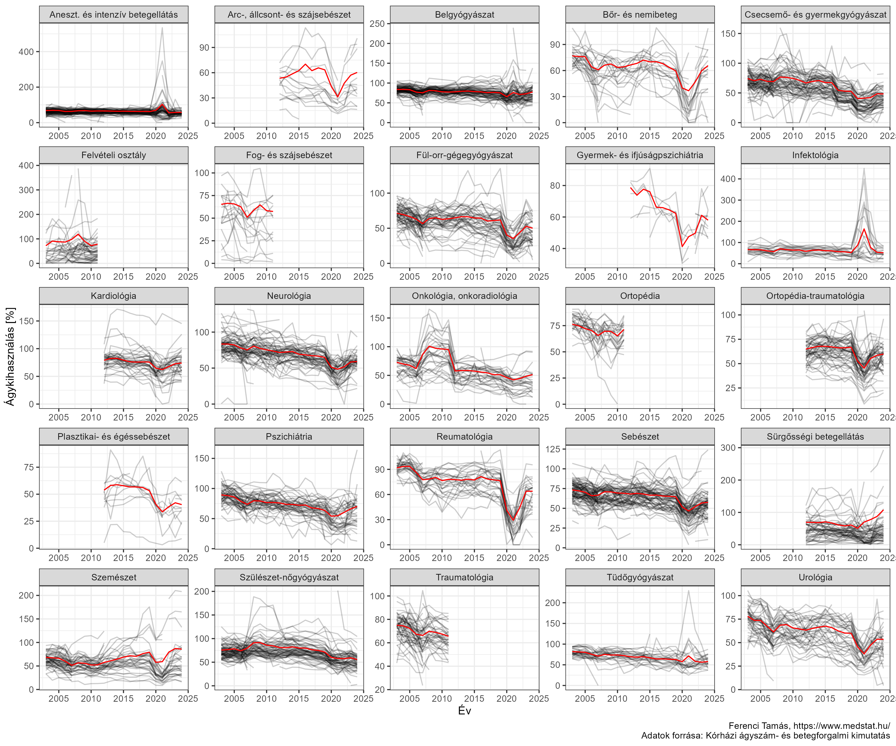<!-- -->

Következő lépésben nézzük meg ugyanezeket az adatokat időbeli metszetben
is, itt minden vonal egy kórházat jelöl:

``` r
ggplot(res[NemSpecSzakma==TRUE], aes(x = Ev, y = Halalozas, color = KorhazRovid, group = KorhazRovid)) +
  geom_line() + facet_wrap(~SzakmaMegnev, scales = "free") + guides(color = "none") +
  labs(x = "Év", y = "Halálozási arány [%]")
```

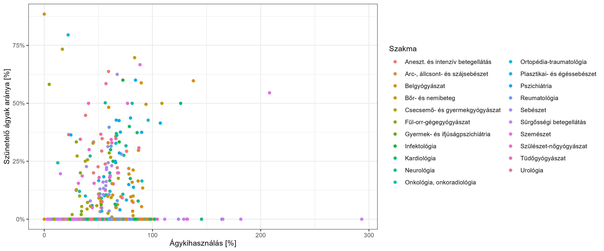<!-- -->

A rejtélyeket nem igazán oldja fel a dolog, sőt, az bizonyos tekintetben
inkább csak fokozódik: látszik, hogy a pszichiátrián a kilógó érték nem
egy egyszeri történés volt, hanem egy több éven át tartó tendencia. Erre
végképp nincsen magyarázatom (hacsak nem a betegösszetétel tényleg
ennyire extrém).

Az ábráról azonban sokkal fontosabb dolgok is leolvashatóak. Egyrészt
vannak elég látványos hosszú távú trendek, például a belgyógyászatokon
folyamatosan nő a halálozás. Adat híján nehéz pontosan mondani, de erős
tippem, hogy valójában semmi különös nem történik, csak az ellátott
betegek egyre idősebbek, és törékenyebb állapotúak. Természetesen ennek
megítéléséhez (ami elsőrendű érdeke lenne az ország egészségügyének…)
kellenének a pontosabb adatok. Jól látható a járvány hatása is: az
intenzív ellátásban és az infektológián megugró halálozás.

## Záró gondolatok

Remélem, hogy a fenti sorok két – csak első ránézésre ellentétes –
dologra rá tudtak mutatni: egyrészt, hogy az ágyszám- és betegforgalmi
kimutatások adatai értékesek és érdekesek (és talán emiatt nem volt
felesleges a feldolgozható formára hozása és közzététele, hátha ez
további elemzéseket is serkent), másrészt, hogy közben egy nagyon fontos
feladat, a teljesítménymérés megoldásához azonban még egyáltalán nem
tudjuk ezeket használni. Ehhez további adatokra volna szükség; de
remélem meg tudtam mutatni azt is, hogy ez alapvető fontosságú lenne a
magyar egészségügy fejlesztéséhez. Nem kis feladat – de megoldható. A
szűk keresztmetszet ehhez, úgy hiszem, nem a módszertan, hanem a
politikai szféra támogatása.

------------------------------------------------------------------------

(Az írás a 2022. augusztus 5-én érvényes állapotot tükrözi.)

A [szerző](http://www.medstat.hu/) klinikai biostatisztikus,
orvosbiológiai mérnök. A fent leírtak teljes egészében a magánvéleményét
képviselik.

## Függelék

### Technikai részletek

Első lépésben kézzel letöltöttem a NEAK honlapjáról az egyes évek
adatait (ki kell csomagolni egy `zip` fájlból; a régiek `doc`
formátumban vannak meg), majd minden egyes év adatát kézzel átmentettem
`docx` formátumban. (Ennek nagy jelentősége nincsen, csak a később
használt `R` csomag a `docx` formátumot tudja minden további nélkül
kezelni.)

Az adatok feldolgozásához a `docxtractr` nevű R csomag jelenti a
megoldást, ez be tud olvasni `docx` formátumú fájlt, sőt, ki tudja
belőle szedni a táblázatokat (akár egyszerre az összeset, egy listában),
ráadásul még azt is jól tudja kezelni, hogy egy táblázat több oldalon
keresztül folytatódik.

Elsőként megadom a használt kódot, utána kommentálom hosszabban, hogy az
mit is csinál:

``` r
if(!file.exists("res.rds")) {
  headernames <- c("Korhaz", "SzakmaKod", "SzakmaMegnev", "OsszesAgy",
                   "MukodoIAgy", "MukodoIIAgy", "TartoSzuneteloAgy",
                   "OsszesAtlagAgy", "MukodoAtlagAgy", "ElbocsatottBetegSzam",
                   "EltavozottBetegSzam", "MasOsztalyBetegSzam", "MeghaltBetegSzam",
                   "EgynaposEsetSzam", "TeljesithetoApolasiNapSzam",
                   "TeljesitettApolasiNapSzam", "ApolasAtlTartam", "Agykihasznalas",
                   "Halalozas")
  
  files <- list.files("./doc/")
  
  res <- rbindlist(lapply(files, function(file) {
    yr <- regmatches(file, gregexpr("\\d{4}", file))[[1]]
    
    doc <- docxtractr::read_docx(paste0("./doc/", file))
    
    res <- docxtractr::docx_extract_all_tbls(doc)
    res <- lapply(res, as.data.table)
    
    FenntartoTablaNum <- which(sapply(res, function(x)
      names(x[1,1]))==paste0("Kórházi.ágyszám..és.betegforgalmi.kimutatás.fenntartónként", yr, "..év"))
    
    Fenntartok <- data.table(Fenntarto = res[[FenntartoTablaNum]][[1]],
                             KorhazRovid = res[[FenntartoTablaNum]][[1]])
    Fenntartok[nchar(Fenntartok$Fenntarto)==4]$Fenntarto <- NA
    Fenntartok <- tidyr::fill(Fenntartok, Fenntarto)
    Fenntartok <- Fenntartok[!is.na(Fenntarto)&!is.na(KorhazRovid)]
    Fenntartok <- Fenntartok[nchar(KorhazRovid)==4]
    
    res <- res[sapply(res, function(x)
      names(x[1, 1])==paste0("Kórházi.ágyszám..és.betegforgalmi.kimutatás", yr, "..év")&
        substring(x[1, 1], 1, 4)%in%Fenntartok$KorhazRovid)]
    
    res <- rbindlist(lapply(1:length(res), function(i) {
      firstactive <- grep("Aktív", res[[i]][[2]], ignore.case = TRUE)[1]
      firstchronic <- grep("Krónikus", res[[i]][[2]], ignore.case = TRUE)[1]
      if(firstactive>firstchronic) NULL else
        setNames(cbind(res[[i]][1,1], res[[i]][6:(firstactive-1),]), headernames)
    }))
    
    for(i in headernames[-(1:3)]) res[[i]] <- as.numeric(stringr::str_replace_all(
      res[[i]], c("," = ".", "[[:space:]]" = "")))
    
    res$Ev <- as.integer(yr)
    
    res$KorhazRovid <- substring(res$Korhaz, 1, 4)
    merge(res, Fenntartok, by = "KorhazRovid")
  }))
  
  res <- res[order(Ev)]
  res$KorhazNev <- ifelse(do.call(c, gregexpr("(", res$Korhaz, fixed = TRUE))==-1,
                        substring(res$Korhaz, 6), substring(res$Korhaz, 6, nchar(res$Korhaz)-17))
  
  saveRDS(res, "res.rds")
} else res <- readRDS("res.rds")
```

A következő kommentárok tartoznak a fentiekhez:

-   A fenntartó azt jelenti, hogy milyen típusú fenntartója van az
    intézménynek (központi, önkormányzati, egyházi stb.). Ezt
    tulajdonképpen hagyhatnánk is, de bizonyos elemzéseknél jól jön, ha
    ki tudjuk zárni az elég atipikus intézményeket (pl. vállalkozások
    által fenntartott intézményeket, melyek jellemzően nulla ágyszámmal
    csak egynapos ellátást nyújtanak), úgyhogy érdemes lehet nem veszni
    hagyni. Ha viszont e mellett döntünk, akkor kicsit küzdeni kell. A
    dokumentumok jellemzően az elején (de még az sem egységes, hogy
    melyik táblázatban, ezért kell a `FenntartoTablaNum`-ban kikeresni a
    sorszámot) közlik a fenntartókat, de nagyon szerencsétlen
    formátumban: egy oszlopban van a fenntartó és az intézmény. Ezt úgy
    kell elképzelni, hogy először szerepel az „önkormányzati eü.
    intézmény” kifejezés, majd utána jönnek az ilyen fenntartójúak
    azonosítói, aztán egy „központi eü. intézmény” szó, majd sorakoznak
    ezek kódjai stb., ráadásul közben még összegzősorok is vannak. A
    problémát egy trükkel oldjuk meg: ezt az oszlopot kétszer egymás
    mellé másoljuk, majd az egyik oszlopból kitöröljük azokat az
    értékeket, amik nem 4 hosszúak. Ezzel magyarul kitöröltük a kórházak
    azonosítóit, és meghagytuk a felirat-szövegeket. (A dolgot az teszi
    lehetővé, hogy a kórház azonosító mindig 4 karakter, viszont a
    feliratok reményeim szerint soha.) Ezt következően a kiüresített
    helyekre lehúzzuk fentről az utolsó szöveget – a `tidyr::fill` pont
    ezt teszi – így végeredményben egymás *mellé* kerültek, ahogy arra
    szükségünk van, a fenntartók és a kódok. Nincs más dolgunk, mint
    kitörölni a felesleges sorokat, azaz a feliratok és az
    összegző-sorokat, de ezt könnyen megtaláljuk azáltal, hogy ezeknél a
    kód oszlop nem 4 hosszúságú.
-   A rengeteg táblázatból meg kell keresni azt az egyetlen kombinációt,
    ami érdekel minket: az intézményre lebontott táblákat. Az ilyeneket
    két feltétellel azonosítjuk: egyrészt a bal szélső oszlop neve adott
    értékű mindig, másrészt leellenőrizzük, hogy a bal felső cellában –
    elvileg itt kell a kórház azonosítója szerepeljen – a megadott
    négyjegyű kód tényleg valódi kórházazonosító-e. (Ezeket az
    azonosítókat az előző lépésnek köszönhetően már ismerjük.)
-   A következő probléma az aktív és krónikus ellátások elkülönítése. A
    2012 és azt követő évek táblázataiban nincsen probléma, ezeknél
    ugyanis a krónikus ellátást biztosító szakmáknál üres a szakmakód,
    így nyugodtan legyűjthetjük „ész nélkül” az összes megfelelő
    táblázatot, maximum a végén elhagyjuk azokat, ahol nincs szakmakód.
    A probléma az, hogy 2012 előtt nem követték ezt a szabályt, és a
    krónikus ellátást végző szakmák mellett is fel volt tüntetve a
    szakmakód. Ez azért gond, mert ezek a kódok átfednek az aktív
    szakmák kódjaival, sőt, akár még egy kórházon belül is előfordulhat
    mindkettő (például 2011-ben a Szt. Imre Kórháznak volt 18-as
    szakmakódú pszichiátriából aktív *és* krónikus ellátása is). De az
    sem jó megoldás, hogy elkezdjük legyűjteni a sorokat addig, amíg van
    szakmakód, mert van olyan kórház, amiben egyáltalán nincs aktív
    ellátás. Végül azt a megoldást találtam ki, hogy megkeressük az
    „aktív” és a „krónikus” szavak előfordulását (ezek az
    összegző-sorokban biztosan szerepelnek). Ha az „aktív” szó csak a
    „krónikus” után van, akkor nincs aktív ellátás (a szó az „aktív és
    krónikus összesen” nagy összegző sorban szerepelt), ezt az
    intézményt átugorhatjuk, ha nem, akkor a kettő *közötti* sorokat
    kell kiszednünk. Ez a megoldás már jól működőnek tűnik, viszont így
    deklarálni kell, hogy az elemzés kizárólag az aktív ellátásra terjed
    ki.
-   A számokat tartalmazó sorokban szóköz az ezres elválasztó,
    tizedevessző a tizedesjelölő, az előbbieket el kell távolítani, az
    utóbbiakat vesszőre kell cserélni, hogy számmá lehessen alakítható
    (erre a feladatra a `stringr::str_replace_all` kényelmesebb mint a
    `gsub`).
-   Szerencsére az oszlopok sorrendje és tartalma végig ugyanaz (ezt
    tartalmazza a `headernames` változó).
-   A kórház kódja szerencsére mindig a nevének az első négy karaktere.

A fentiek végén megkapjuk a kialakítani tervezett táblázat első
változatát. Mindenek előtt végezzünk rajta pár adatvalidációt.

Egyedi kórháznévből összesen 628 van, de ez valójában nem jelöl ennyi
kórházat, hiszen sok kórház neve változott az évek alatt. A rekord 7:
összesen 5 kórház is van, aminek ennyi különböző neve volt 2003 és 2021
között. Szerencsére gyors átfutás alapján az adatok rendben vannak, azaz
ugyanahhoz a kód ténylegesen ugyanaz a kórház tartozik (még ha a neve
változott is). Így a kód megfelelő azonosító.

Nézzük most a szakmákat:

``` r
knitr::kable(as.data.table(table(res$SzakmaKod, res$SzakmaMegnev))[N!=0][
  order(V1), .(`Szakmakód` = V1, `Szakma megnevezése` = V2)])
```

<table>
<thead>
<tr>
<th style="text-align:left;">
Szakmakód
</th>
<th style="text-align:left;">
Szakma megnevezése
</th>
</tr>
</thead>
<tbody>
<tr>
<td style="text-align:left;">
</td>
<td style="text-align:left;">
Rendkívüli osztály
</td>
</tr>
<tr>
<td style="text-align:left;">
01
</td>
<td style="text-align:left;">
Belgyógyászat
</td>
</tr>
<tr>
<td style="text-align:left;">
02
</td>
<td style="text-align:left;">
Sebészet
</td>
</tr>
<tr>
<td style="text-align:left;">
03
</td>
<td style="text-align:left;">
Traumatológia
</td>
</tr>
<tr>
<td style="text-align:left;">
04
</td>
<td style="text-align:left;">
Szülészet-nőgyógyászat
</td>
</tr>
<tr>
<td style="text-align:left;">
05
</td>
<td style="text-align:left;">
Csecs.- és gyermekgyógy.
</td>
</tr>
<tr>
<td style="text-align:left;">
05
</td>
<td style="text-align:left;">
Csecsemő- és gyermekgyógyászat
</td>
</tr>
<tr>
<td style="text-align:left;">
06
</td>
<td style="text-align:left;">
Fül-orr-gégegyógyászat
</td>
</tr>
<tr>
<td style="text-align:left;">
06
</td>
<td style="text-align:left;">
Fül-orr-gégészet
</td>
</tr>
<tr>
<td style="text-align:left;">
07
</td>
<td style="text-align:left;">
Szemészet
</td>
</tr>
<tr>
<td style="text-align:left;">
08
</td>
<td style="text-align:left;">
Bőr- és nemibeteg
</td>
</tr>
<tr>
<td style="text-align:left;">
08
</td>
<td style="text-align:left;">
Bőrgyógyászat
</td>
</tr>
<tr>
<td style="text-align:left;">
09
</td>
<td style="text-align:left;">
Ideggyógyászat
</td>
</tr>
<tr>
<td style="text-align:left;">
09
</td>
<td style="text-align:left;">
Neurológia
</td>
</tr>
<tr>
<td style="text-align:left;">
10
</td>
<td style="text-align:left;">
Ortopédia
</td>
</tr>
<tr>
<td style="text-align:left;">
10
</td>
<td style="text-align:left;">
Ortopédia-traumatológia
</td>
</tr>
<tr>
<td style="text-align:left;">
11
</td>
<td style="text-align:left;">
Urológia
</td>
</tr>
<tr>
<td style="text-align:left;">
12
</td>
<td style="text-align:left;">
Klinikai onkológia
</td>
</tr>
<tr>
<td style="text-align:left;">
12
</td>
<td style="text-align:left;">
Onkológia, onkoradiológia
</td>
</tr>
<tr>
<td style="text-align:left;">
13
</td>
<td style="text-align:left;">
Fog- és szájsebészet
</td>
</tr>
<tr>
<td style="text-align:left;">
13
</td>
<td style="text-align:left;">
Fogászati ellátás
</td>
</tr>
<tr>
<td style="text-align:left;">
14
</td>
<td style="text-align:left;">
Reumatológia
</td>
</tr>
<tr>
<td style="text-align:left;">
15
</td>
<td style="text-align:left;">
Aneszteziológiai és intenzív betegellátás
</td>
</tr>
<tr>
<td style="text-align:left;">
15
</td>
<td style="text-align:left;">
Intenzív betegellátó
</td>
</tr>
<tr>
<td style="text-align:left;">
16
</td>
<td style="text-align:left;">
Fertőző betegellátó
</td>
</tr>
<tr>
<td style="text-align:left;">
16
</td>
<td style="text-align:left;">
Infektológia
</td>
</tr>
<tr>
<td style="text-align:left;">
17
</td>
<td style="text-align:left;">
Arc-, állcsont- és szájsebészet
</td>
</tr>
<tr>
<td style="text-align:left;">
17
</td>
<td style="text-align:left;">
Felvételi osztály
</td>
</tr>
<tr>
<td style="text-align:left;">
18
</td>
<td style="text-align:left;">
Elmegyógyászat
</td>
</tr>
<tr>
<td style="text-align:left;">
18
</td>
<td style="text-align:left;">
Pszichiátria
</td>
</tr>
<tr>
<td style="text-align:left;">
19
</td>
<td style="text-align:left;">
Tüdőgyógyászat
</td>
</tr>
<tr>
<td style="text-align:left;">
19
</td>
<td style="text-align:left;">
Tüdőgyógyászat (pulmonológia)
</td>
</tr>
<tr>
<td style="text-align:left;">
20
</td>
<td style="text-align:left;">
Plasztikai- és égéssebészet
</td>
</tr>
<tr>
<td style="text-align:left;">
23
</td>
<td style="text-align:left;">
Gyermek- és ifjúságpszichiátria
</td>
</tr>
<tr>
<td style="text-align:left;">
40
</td>
<td style="text-align:left;">
Kardiológia
</td>
</tr>
<tr>
<td style="text-align:left;">
46
</td>
<td style="text-align:left;">
Sürgősségi betegellátás
</td>
</tr>
<tr>
<td style="text-align:left;">
90
</td>
<td style="text-align:left;">
Mátrix intézet
</td>
</tr>
<tr>
<td style="text-align:left;">
91
</td>
<td style="text-align:left;">
Belgyógyászati típusú mátrix
</td>
</tr>
<tr>
<td style="text-align:left;">
92
</td>
<td style="text-align:left;">
Sebészeti típusú mátrix
</td>
</tr>
</tbody>
</table>

Amint látható, itt már van egy kis kavarodás, de egy kivételtől
eltekintve nem szó szerinti gond, csak a szakma megnevezése nem volt
egységes. Az egyetlen kivétel a 17-es kód, itt tényleges gikszer van:
2003-tól 2011-ig ezt a „Felvételi osztály” szakmára használják, utána
viszont egy durva hiba történik, mert *ugyanazt* a kódot kiosztják egy
teljesen más szakmának („Arc-, állcsont- és szájsebészet”). A 17-es kód
tehát bizonytalan, a megnevezés mindenesetre használható.

Az egységesség kedvéért javítsuk ki az ingadozó elnevezéseket is (az
ízlés kérdése, hogy melyiket módosítjuk melyikre, a lényeg, hogy
egységes legyen), illetve egy szakmanevet lerövidítünk, hogy jobban
kiférjen az ábrákon:

``` r
res[SzakmaMegnev=="Csecs.- és gyermekgyógy."]$SzakmaMegnev <- "Csecsemő- és gyermekgyógyászat"
res[SzakmaMegnev=="Fül-orr-gégészet"]$SzakmaMegnev <- "Fül-orr-gégegyógyászat"
res[SzakmaMegnev=="Bőrgyógyászat"]$SzakmaMegnev <- "Bőr- és nemibeteg"
res[SzakmaMegnev=="Ortopédia"]$SzakmaMegnev <- "Ortopédia-traumatológia"
res[SzakmaMegnev=="Traumatológia"]$SzakmaMegnev <- "Ortopédia-traumatológia"
res[SzakmaMegnev=="Klinikai onkológia"]$SzakmaMegnev <- "Onkológia, onkoradiológia"
res[SzakmaMegnev=="Fogászati ellátás"]$SzakmaMegnev <- "Fog- és szájsebészet"
res[SzakmaMegnev=="Intenzív betegellátó"]$SzakmaMegnev <- "Aneszteziológiai és intenzív betegellátás"
res[SzakmaMegnev=="Fertőző betegellátó"]$SzakmaMegnev <- "Infektológia"
res[SzakmaMegnev=="Elmegyógyászat"]$SzakmaMegnev <- "Pszichiátria"
res[SzakmaMegnev=="Tüdőgyógyászat (pulmonológia)"]$SzakmaMegnev <- "Tüdőgyógyászat"
res[SzakmaMegnev=="Ideggyógyászat"]$SzakmaMegnev <- "Neurológia"
res[SzakmaMegnev=="Felvételi osztály"]$SzakmaMegnev <- "Sürgősségi betegellátás"

res[SzakmaMegnev=="Aneszteziológiai és intenzív betegellátás"]$SzakmaMegnev <-
  "Aneszt. és intenzív betegellátás"
```

Ezek után már a megnevezés aggálytalanul használható.

Ezzel végeztünk az előkészületekkel, nincs más dolgunk mint
feldolgozható formában is lementeni az adatokat:

``` r
fwrite(res, "KorhaziAgyszamEsBetegforgalom.csv", sep = ";", dec = ",", row.names = FALSE, bom = TRUE)
openxlsx::write.xlsx(res, "KorhaziAgyszamEsBetegforgalom.xlsx")
```

A későbbi szűkítések leegyszerűsítésére mentsünk el egy indikátort a
speciális fenntartójú kórházakhoz (börtönkórház, IMEI, vállalkozás által
fenntartott egészségklinika stb.), és a speciális szakmákhoz (rendkívül
osztály, mátrixintézet stb.); a későbbiekben ezeket majd sokszor
kizárjuk a vizsgálatokból:

``` r
res$NemSpecKh <- res$Fenntarto%in%c("Önkormányzati kórházak", "Egyházi kórházak",
                                    "Klinikák", "Állami kórházak", "HM és BM kórházak",
                                    "MÁV kórházak", "Központi intézmény", "Egyházi",
                                    "Egyetem", "Önkormányzati eü. intézmény",
                                    "Központi eü. intézmény", "Egyházi intézmény")
res$NemSpecSzakma <- res$SzakmaKod!=""&!grepl("mátrix", res$SzakmaMegnev, ignore.case = TRUE)
```

(Még így is nagyon sok pl. rendelőintézet belekerül a listánkba, de ezek
könnyen elkülöníthetőek lesznek, hiszen nulla az ágyszámuk.)

Most már nekiláthatunk az elemzésnek! Ahogy mondtam is, a dolog inkább
illusztratív lesz, de remélem néhány érdekes dolgot meg fogok tudni
mutatni. Az adatok feldolgozásához a `data.table`, a vizualizációhoz a
`ggplot2` csomagot használtam.

### Adatvalidáció

Az egyik változó, ami más adatokkal validálható, az ágykihasználás. Az
egyszerűség kedvéért vegyünk egy konkrét példát: 2021-ben a hatvani
Albert Schweitzer Kórház (1035) 15-ös kódú intenzív osztályán az ápolás
átlagos időtartama 6.49 nap volt. Ez azt jelenti, hogy ha abban a
pillanatban, hogy felszabadult egy ágy, azonnal új beteg került rá, egy
év alatt összesen 365/6.49 = 56.2 beteget tudtak ellátni. Mivel az évben
átlagosan 6 ágyuk volt, ez összesen 6 · 56.2 = 337.4 beteg. Igen ám, de
közben a tényleges betegforgalom 1841 beteg volt! (Az elméleti maximum
5.5-szerese!) Ezt – intenzív osztályról lévén szó nem meglepő módon – az
egynapos ellátás sem tudja megmagyarázni, ilyen ugyanis nem volt.

Nem tudom a jelenség magyarázata mi lehet, kézenfekvőnek tűnik, hogy a
koronavírus-járvány miatt került ide sok beteg, nagyobb ágyszámon, de ha
így van, akkor meg az átlagos ágyszám adata hibás, hiszen annak
*elvileg* tükröznie kell az egész évben történt változásokat (ennek a
definíciója ugyanis a kimutatás szerint: „kórházi ágyak számának a
tárgyév során bekövetkezett változásait is tükröző súlyozott átlaga”).
Érdekes azt is megjegyezni, hogy igazából már az átlagos ápolási
időtartam sem stimmel (vagy jobban mondva legalábbis nem konzisztens a
többi adattal): a NEAK [definíciója
szerint](http://site.oep.hu/statisztika/2011/pdf/hun/Fekvobeteg_modszertan_2011.pdf)
ez aktív ellátás esetén „a teljesített ápolási napok száma osztva az
osztályokról elbocsátott betegek számával”, jelen esetben 11705 / 1841 =
6.36, ami nem egyezik pontosan a táblázatban szereplő értékkel. (Ez az
apró eltérés az oka annak, hogy a fenti kiszámolt hányados nem egyezik
pontosan a táblában közölt ágykihasználással, ami 534.47%, mindenesetre
ez is bőven 100% feletti.) A dolog nem egyedi, összesen 339 példa van
ilyen adatra. Egyáltalán nem csak a koronavírus-járvány éveiről van szó,
jó kérdés tehát, hogy mi lehet a magyarázat…

Ha már említettük az egynapos ellátást, érdemes arra is ránézni. Itt is
hozok konkrét példát: 2011-ben a László Kórház (0109) 07-es szakmakódú
szemészete nem rendelkezett egyetlen ággyal sem, mégis elbocsátott 937
beteget. Ez nem meglepő, mert egynapos ellátást nyújtott – igen ám, csak
az egynapos ellátási események száma 934 volt. A különbség nem nagy,
talán csak banális adminisztrációs hibáról van szó, mindenesetre a
teljes adatbázisban 987 esetben fordul elő, hogy működő ágy nélkül
osztályok több beteget bocsátottak el, mint ahány egynapos esetük volt.
